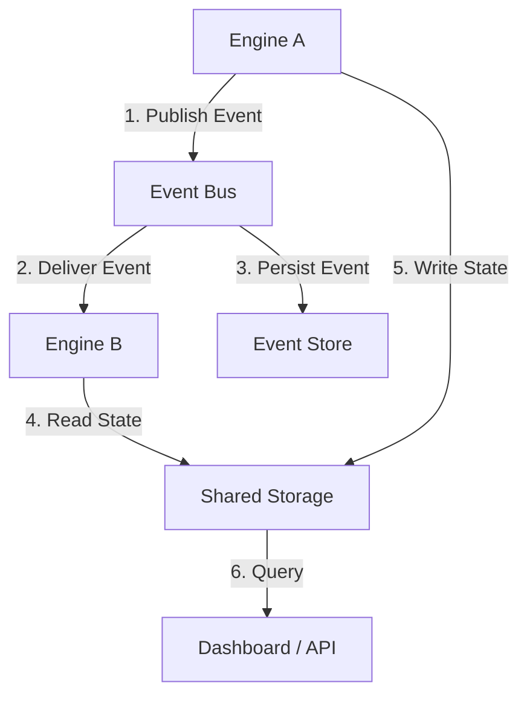
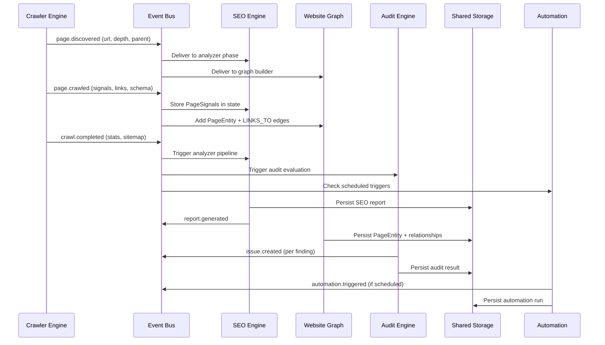

# Website Intelligence Platform — Architecture Blueprint

**Version:** 1.0.0
**Status:** Approved for Implementation
**Based on:** Sprint 12B Technical Design Specification + SEO Engine v0.4.0 + Crawler Engine v0.1.0

---

## Table of Contents

1. [Executive Summary](#1-executive-summary)
2. [Engine SDK](#2-engine-sdk-highest-priority)
3. [Event Bus](#3-event-bus)
4. [Rule Engine](#4-rule-engine)
5. [Knowledge Graph Compatibility](#5-knowledge-graph-compatibility)
6. [Engine Communication](#6-engine-communication)
7. [Shared Storage Layer](#7-shared-storage-layer)
8. [Shared Configuration](#8-shared-configuration)
9. [Shared Metrics](#9-shared-metrics)
10. [Shared Logging](#10-shared-logging)
11. [Final Architecture](#11-final-architecture)
12. [Folder Structure Changes](#12-folder-structure-changes)
13. [Migration Strategy](#13-migration-strategy)
14. [Risks and Trade-offs](#14-risks-and-trade-offs)
15. [Recommended Implementation Order](#15-recommended-implementation-order)

---

## 1. Executive Summary

This document refines the Sprint 12B Technical Design into a unified **Website Intelligence Platform** architecture. The core principle: **eliminate duplication through shared infrastructure** while maintaining strict engine isolation.

### Current Foundation (Completed)

| Component | Version | Location |
|-----------|---------|----------|
| SEO Engine | 0.4.0-analyzer-title | `seo-agent/` |
| Plugin Architecture | Core v0.1.0 | `seo-agent/core/` |
| Crawler Engine | 0.1.0-core | `crawler/` |
| Repository Layer | Supabase + Memory | `lib/`, `crawler/storage/` |
| Report Storage | SQL + API | `supabase/migrations/0007`, `lib/seo/report-service.ts` |

### Target Engines (Future)

| Engine | Responsibility | Dependency on SDK |
|--------|----------------|-------------------|
| SEO Engine | Page analysis, scoring, recommendations | Full |
| Crawler Engine | BFS discovery, site map, link graph | Full |
| Audit Engine | Rule evaluation, compliance checking | Full |
| Website Graph | Page → Page relationships, topology | Full |
| Knowledge Graph | Entity extraction, semantic relationships | Full |
| Content Engine | Content generation, optimization | Full |
| Performance Engine | Core Web Vitals, Lighthouse integration | Full |
| Internal Linking Engine | Link suggestions, orphan detection | Full |
| Automation Engine | Scheduled runs, trigger-based workflows | Full |
| AI Optimization Engine | LLM-driven recommendations | Full |
| Search Intelligence Engine | SERP tracking, keyword intelligence | Full |
| Trust Engine | Authority scoring, E-E-A-T signals | Full |
| Learning Engine | Pattern mining, rule evolution | Full |

---

## 2. Engine SDK (Highest Priority)

### 2.1 Design Philosophy

The SDK is the **single source of infrastructure primitives**. Every engine is a thin composition of SDK primitives. No engine duplicates logging, metrics, config, storage, events, or plugin lifecycle.

### 2.2 Package Structure

```
packages/
├── @rentfy/engine-sdk/                    # Published internally (npm workspace)
│   ├── package.json
│   ├── tsconfig.json
│   ├── src/
│   │   ├── index.ts                       # Public exports
│   │   ├── engine/
│   │   │   ├── Engine.ts                  # Base Engine class (generic)
│   │   │   ├── EngineConfig.ts
│   │   │   ├── EngineEvents.ts
│   │   │   ├── EngineRunner.ts
│   │   │   ├── EngineRegistry.ts
│   │   │   ├── types.ts
│   │   │   └── index.ts
│   │   ├── plugin/
│   │   │   ├── Plugin.ts                  # Base Plugin interface (generic)
│   │   │   ├── PluginContext.ts
│   │   │   ├── PluginLifecycle.ts
│   │   │   ├── PluginRegistry.ts
│   │   │   ├── PluginPipeline.ts
│   │   │   ├── PluginMetrics.ts
│   │   │   └── index.ts
│   │   ├── config/
│   │   │   ├── ConfigManager.ts
│   │   │   ├── ConfigSchema.ts
│   │   │   ├── EnvOverrides.ts
│   │   │   ├── RuntimeOverrides.ts
│   │   │   └── index.ts
│   │   ├── storage/
│   │   │   ├── StorageAdapter.ts          # Abstract storage interface
│   │   │   ├── StorageRegistry.ts
│   │   │   ├── Transaction.ts
│   │   │   ├── Query.ts
│   │   │   ├── Migration.ts
│   │   │   └── index.ts
│   │   ├── events/
│   │   │   ├── EventBus.ts
│   │   │   ├── EventTypes.ts
│   │   │   ├── EventSerializer.ts
│   │   │   ├── EventReplay.ts
│   │   │   ├── Subscription.ts
│   │   │   └── index.ts
│   │   ├── logging/
│   │   │   ├── Logger.ts
│   │   │   ├── LogContext.ts
│   │   │   ├── CorrelationId.ts
│   │   │   ├── StructuredLog.ts
│   │   │   ├── LogTransport.ts
│   │   │   └── index.ts
│   │   ├── metrics/
│   │   │   ├── MetricsCollector.ts
│   │   │   ├── MetricTypes.ts
│   │   │   ├── Histogram.ts
│   │   │   ├── Counter.ts
│   │   │   ├── Gauge.ts
│   │   │   └── index.ts
│   │   ├── di/
│   │   │   ├── Container.ts
│   │   │   ├── Token.ts
│   │   │   ├── Provider.ts
│   │   │   ├── Scope.ts
│   │   │   └── index.ts
│   │   └── errors/
│   │       ├── SDKError.ts
│   │       ├── ErrorCodes.ts
│   │       ├── ErrorHandler.ts
│   │       └── index.ts
│   └── tests/
│       └── ...
```

### 2.3 Core Interfaces

#### 2.3.1 Base Engine Interface

```typescript
// packages/@rentfy/engine-sdk/src/engine/types.ts

export type EngineCapability =
  | "analyzer"
  | "generator"
  | "crawler"
  | "auditor"
  | "report"
  | "graph-builder"
  | "optimizer"
  | string;  // Extensible

export type EnginePhase =
  | "bootstrap"
  | "discover"
  | "crawl"
  | "analyze"
  | "evaluate"
  | "generate"
  | "optimize"
  | "report"
  | "persist"
  | string;  // Extensible

export interface EngineMetadata {
  readonly name: string;
  readonly version: string;
  readonly capabilities: ReadonlyArray<EngineCapability>;
  readonly description?: string;
}

export interface EngineRunOptions<TPayload = unknown> {
  capability: EngineCapability;
  payload: TPayload;
  scope?: string;                    // URL, site ID, entity ID
  correlationId?: string;            // For distributed tracing
  pluginOverrides?: Record<string, boolean>;
  priorityOverrides?: Record<string, number>;
  options?: Record<string, unknown>;
  timeoutMs?: number;
}

export interface EngineRunResult<TOutput = unknown> {
  ok: boolean;
  runId: string;
  correlationId?: string;
  engineName: string;
  engineVersion: string;
  startedAt: string;
  completedAt: string;
  durationMs: number;
  executed: ReadonlyArray<PluginExecutionRecord>;
  skipped: ReadonlyArray<PluginSkippedRecord>;
  outputs: Record<string, PluginOutput<TOutput>>;
  payload?: TOutput;
  error?: EngineError;
  metrics: EngineRunMetrics;
}

export interface PluginExecutionRecord {
  pluginId: string;
  pluginName: string;
  phase: EnginePhase;
  startedAt: string;
  completedAt: string;
  durationMs: number;
  success: boolean;
  error?: string;
}

export interface PluginSkippedRecord {
  pluginId: string;
  reason: string;
}

export interface EngineRunMetrics {
  pluginsExecuted: number;
  pluginsSkipped: number;
  pluginsFailed: number;
  totalPluginTimeMs: number;
  memoryDeltaBytes?: number;
}

export interface EngineError extends Error {
  code: string;
  pluginId?: string;
  phase?: EnginePhase;
  recoverable: boolean;
  context?: Record<string, unknown>;
}

export interface Engine<TPayload = unknown, TOutput = unknown> {
  readonly metadata: EngineMetadata;
  readonly registry: PluginRegistry;

  use<TInput, TOutput>(...plugins: ReadonlyArray<Plugin<TInput, TOutput>>): this;
  remove(id: string): boolean;
  enable(id: string): boolean;
  disable(id: string): boolean;
  inspect(): ReadonlyArray<Plugin>;

  run(options: EngineRunOptions<TPayload>): Promise<EngineRunResult<TOutput>>;
}
```

#### 2.3.2 Base Plugin Interface

```typescript
// packages/@rentfy/engine-sdk/src/plugin/Plugin.ts

export type PluginCapability = EngineCapability;
export type PluginPhase = EnginePhase;

export type PluginHook =
  | { kind: "continue" }
  | { kind: "skip"; reason?: string }
  | { kind: "abort"; error: EngineError };

export interface PluginInput<TPayload = unknown> {
  phase: PluginPhase;
  capability: PluginCapability;
  payload: TPayload;
  config: EngineConfig;
  state: PluginState;
  eventBus: EventBus;           // Injected for cross-plugin communication
  logger: Logger;               // Injected for structured logging
  metrics: MetricsCollector;    // Injected for plugin-level metrics
}

export interface PluginOutput<TValue = unknown> {
  pluginId: string;
  kind: "issues" | "data" | "artifact" | "events" | "mutations";
  value: TValue;
  metadata?: PluginOutputMetadata;
}

export interface PluginOutputMetadata {
  executionTimeMs?: number;
  itemsProcessed?: number;
  warnings?: string[];
  deprecated?: boolean;
}

export interface PluginState {
  set(key: string, value: unknown): void;
  get<T = unknown>(key: string): T | undefined;
  has(key: string): boolean;
  delete(key: string): boolean;
  clear(): void;
  entries(): IterableIterator<[string, unknown]>;
  namespace(prefix: string): PluginState;  // Creates namespaced view
}

export interface EngineConfig {
  runId: string;
  correlationId?: string;
  scope?: string;
  enabledPlugins: ReadonlySet<string>;
  priorities: ReadonlyMap<string, number>;
  version: string;
  options: Readonly<Record<string, unknown>>;
  startedAt: string;
}

export interface Plugin<TInput = unknown, TOutput = unknown> {
  readonly id: string;                    // kebab-case, globally unique
  readonly name: string;
  readonly version: string;               // semver
  readonly capability: PluginCapability;
  readonly phase?: PluginPhase;           // Defaults to capability
  readonly priority?: number;             // Lower = earlier, default 100
  readonly enabledByDefault?: boolean;    // Default true
  readonly dependencies?: ReadonlyArray<string>;  // Plugin IDs that must run first
  readonly provides?: ReadonlyArray<string>;      // Capabilities this plugin provides
  readonly requires?: ReadonlyArray<string>;      // Capabilities required from other plugins

  readonly condition?: (input: PluginInput) => PluginHook | Promise<PluginHook>;
  readonly run: (input: PluginInput<TInput>) => PluginOutput<TOutput> | Promise<PluginOutput<TOutput>>;
  readonly teardown?: (input: PluginInput<TInput>, output: PluginOutput<TOutput>) => void | Promise<void>;
}
```

#### 2.3.3 Plugin Registry Interface

```typescript
// packages/@rentfy/engine-sdk/src/plugin/PluginRegistry.ts

export interface PluginRegistryLike {
  register<TInput, TOutput>(plugin: Plugin<TInput, TOutput>): this;
  unregister(id: string): boolean;
  enable(id: string): boolean;
  disable(id: string): boolean;
  has(id: string): boolean;
  get<TInput, TOutput>(id: string): Plugin<TInput, TOutput> | undefined;
  list(): ReadonlyArray<Plugin>;
  byCapability(cap: PluginCapability): ReadonlyArray<Plugin>;
  forPhase(phase: PluginPhase): ReadonlyArray<Plugin>;
  setPriority(id: string, priority: number): boolean;
  size(): number;
  clear(): this;

  // Dependency resolution
  resolveOrder(pluginIds: ReadonlyArray<string>): ReadonlyArray<string>;
  validateDependencies(pluginIds: ReadonlyArray<string>): ValidationResult;
}

export interface ValidationResult {
  valid: boolean;
  errors: ReadonlyArray<{ pluginId: string; message: string }>;
  warnings: ReadonlyArray<{ pluginId: string; message: string }>;
}

export interface PluginRegistry extends PluginRegistryLike {
  // Additional methods for engine composition
  createChildRegistry(): PluginRegistry;
  snapshot(): PluginRegistrySnapshot;
  restore(snapshot: PluginRegistrySnapshot): void;
}

export interface PluginRegistrySnapshot {
  plugins: ReadonlyArray<Plugin>;
  priorities: ReadonlyMap<string, number>;
  disabled: ReadonlySet<string>;
}
```

#### 2.3.4 Plugin Pipeline

```typescript
// packages/@rentfy/engine-sdk/src/plugin/PluginPipeline.ts

export interface PipelineExecutorOptions<TPayload, TOutput> {
  capability: PluginCapability;
  phase: PluginPhase;
  payload: TPayload;
  config: EngineConfig;
  eventBus: EventBus;
  logger: Logger;
  metrics: MetricsCollector;

  onBeforeRun?: (plugin: Plugin, input: PluginInput<TPayload>) => void | Promise<void>;
  onAfterRun?: (plugin: Plugin, output: PluginOutput<TOutput> | null, skipped: boolean, error?: EngineError) => void | Promise<void>;
  onPhaseComplete?: (phase: PluginPhase, results: PhaseResult<TOutput>) => void | Promise<void>;
}

export interface PhaseResult<TOutput = unknown> {
  phase: PluginPhase;
  ok: boolean;
  executed: ReadonlyArray<string>;
  skipped: ReadonlyArray<PluginSkippedRecord>;
  outputs: Record<string, PluginOutput<TOutput>>;
  error?: EngineError;
  durationMs: number;
}

export const runPipeline = async <TPayload, TOutput>(
  plugins: ReadonlyArray<Plugin>,
  options: PipelineExecutorOptions<TPayload, TOutput>
): Promise<PhaseResult<TOutput>> => {
  // Implementation: sequential execution with condition evaluation,
  // error isolation, teardown guarantees, metrics emission
};
```

#### 2.3.5 Configuration System

```typescript
// packages/@rentfy/engine-sdk/src/config/ConfigManager.ts

export interface ConfigSchema {
  properties: Record<string, ConfigProperty>;
  required?: ReadonlyArray<string>;
  additionalProperties?: boolean;
}

export interface ConfigProperty {
  type: "string" | "number" | "boolean" | "object" | "array";
  description?: string;
  default?: unknown;
  enum?: ReadonlyArray<unknown>;
  minimum?: number;
  maximum?: number;
  pattern?: string;
}

export interface ConfigSource {
  name: string;
  priority: number;           // Higher = overrides lower
  load(): Promise<Record<string, unknown>> | Record<string, unknown>>;
  watch?(callback: (changes: ConfigChanges) => void): () => void;
}

export interface ConfigChanges {
  engine?: string;
  plugin?: string;
  key: string;
  oldValue: unknown;
  newValue: unknown;
  source: string;
}

export class ConfigManager {
  private sources: ConfigSource[] = [];
  private cache = new Map<string, Record<string, unknown>>();
  private subscribers = new Set<(changes: ConfigChanges) => void>();

  addSource(source: ConfigSource): this;
  removeSource(name: string): boolean;

  get<TEngine extends string, TPlugin extends string>(
    engine: TEngine,
    plugin?: TPlugin
  ): Promise<Record<string, unknown>>;

  getGlobal(): Promise<Record<string, unknown>>;

  override(engine: string, plugin: string, key: string, value: unknown): void;
  clearOverride(engine: string, plugin: string, key: string): void;

  validate(config: unknown, schema: ConfigSchema): ValidationResult;

  onChange(callback: (changes: ConfigChanges) => void): () => void;
}

// Default source priority (highest wins):
// 1. Runtime overrides (programmatic)
// 2. Environment variables (ENGINE_PLUGIN_KEY=value)
// 3. Config file (config/{engine}.{plugin}.json)
// 4. Global defaults (config/global.json)
// 5. Engine defaults (config/{engine}/defaults.json)
// 6. Plugin defaults (from plugin definition)
```

#### 2.3.6 Dependency Injection Container

```typescript
// packages/@rentfy/engine-sdk/src/di/Container.ts

export type Scope = "singleton" | "transient" | "scoped";

export interface Token<T = unknown> {
  readonly name: string;
  readonly scope?: Scope;
}

export interface Provider<T = unknown> {
  readonly token: Token<T>;
  readonly useClass?: new (...args: unknown[]) => T;
  readonly useFactory?: (...deps: unknown[]) => T | Promise<T>;
  readonly useValue?: T;
  readonly deps?: ReadonlyArray<Token>;
  readonly scope?: Scope;
}

export interface Container {
  register<T>(provider: Provider<T>): this;
  registerToken<T>(token: Token<T>, provider: Provider<T>): this;
  unregister(token: Token): boolean;

  resolve<T>(token: Token<T>): Promise<T>;
  resolveSync<T>(token: Token<T>): T;

  createScope(): Container;
  dispose(): Promise<void>;

  isRegistered(token: Token): boolean;
}

// Standard tokens provided by SDK:
export const SDK_TOKENS = {
  eventBus: new Token<EventBus>("sdk.eventBus"),
  logger: new Token<Logger>("sdk.logger"),
  metrics: new Token<MetricsCollector>("sdk.metrics"),
  config: new Token<ConfigManager>("sdk.config"),
  storage: new Token<StorageAdapter>("sdk.storage"),
  errorHandler: new Token<ErrorHandler>("sdk.errorHandler"),
} as const;
```

#### 2.3.7 Error Handling

```typescript
// packages/@rentfy/engine-sdk/src/errors/

export const SDK_ERROR_CODES = {
  // Engine errors
  ENGINE_NOT_INITIALIZED: "ENGINE_NOT_INITIALIZED",
  ENGINE_RUN_FAILED: "ENGINE_RUN_FAILED",
  ENGINE_TIMEOUT: "ENGINE_TIMEOUT",

  // Plugin errors
  PLUGIN_NOT_FOUND: "PLUGIN_NOT_FOUND",
  PLUGIN_REGISTRATION_FAILED: "PLUGIN_REGISTRATION_FAILED",
  PLUGIN_EXECUTION_FAILED: "PLUGIN_EXECUTION_FAILED",
  PLUGIN_CONDITION_ABORTED: "PLUGIN_CONDITION_ABORTED",
  PLUGIN_DEPENDENCY_CYCLE: "PLUGIN_DEPENDENCY_CYCLE",
  PLUGIN_DEPENDENCY_MISSING: "PLUGIN_DEPENDENCY_MISSING",

  // Config errors
  CONFIG_VALIDATION_FAILED: "CONFIG_VALIDATION_FAILED",
  CONFIG_SOURCE_UNAVAILABLE: "CONFIG_SOURCE_UNAVAILABLE",

  // Storage errors
  STORAGE_UNAVAILABLE: "STORAGE_UNAVAILABLE",
  STORAGE_TRANSACTION_FAILED: "STORAGE_TRANSACTION_FAILED",
  STORAGE_QUERY_FAILED: "STORAGE_QUERY_FAILED",

  // Event errors
  EVENT_PUBLISH_FAILED: "EVENT_PUBLISH_FAILED",
  EVENT_SUBSCRIPTION_FAILED: "EVENT_SUBSCRIPTION_FAILED",
  EVENT_SERIALIZATION_FAILED: "EVENT_SERIALIZATION_FAILED",

  // DI errors
  DI_CIRCULAR_DEPENDENCY: "DI_CIRCULAR_DEPENDENCY",
  DI_PROVIDER_NOT_FOUND: "DI_PROVIDER_NOT_FOUND",
  DI_SCOPE_DISPOSED: "DI_SCOPE_DISPOSED",
} as const;

export class SDKError extends Error {
  readonly code: string;
  readonly recoverable: boolean;
  readonly context?: Record<string, unknown>;
  readonly cause?: Error;

  constructor(code: string, message: string, options?: {
    recoverable?: boolean;
    context?: Record<string, unknown>;
    cause?: Error;
  });
}

export interface ErrorHandler {
  handle(error: Error, context?: ErrorContext): Promise<ErrorHandlingResult>;
  registerHandler(code: string, handler: ErrorHandlerFn): void;
}

export interface ErrorContext {
  engineName?: string;
  pluginId?: string;
  phase?: string;
  runId?: string;
  correlationId?: string;
  metadata?: Record<string, unknown>;
}

export interface ErrorHandlingResult {
  handled: boolean;
  retry?: boolean;
  fallbackValue?: unknown;
  transformedError?: Error;
}

export type ErrorHandlerFn = (error: Error, context: ErrorContext) => Promise<ErrorHandlingResult>;
```

---

## 3. Event Bus

### 3.1 Design Requirements

| Requirement | Implementation |
|-------------|----------------|
| Publish/Subscribe | Typed channels with wildcard support |
| Typed Events | TypeScript generics + runtime validation (Zod) |
| Async Processing | Non-blocking, ordered per channel |
| Event Replay | Event store with cursor-based replay (future) |
| Priority Events | Priority queue per subscription |
| Error Isolation | Subscriber failures never block publisher |
| Event Versioning | Schema version in event envelope, migration functions |

### 3.2 Core Event Types

```typescript
// packages/@rentfy/engine-sdk/src/events/EventTypes.ts

export interface EventEnvelope<T = unknown> {
  readonly id: string;                    // UUID v7 (time-ordered)
  readonly type: string;                  // "page.discovered", "audit.completed"
  readonly version: number;               // Schema version
  readonly timestamp: string;             // ISO 8601
  readonly correlationId?: string;        // For distributed tracing
  readonly causationId?: string;          // ID of event that caused this
  readonly source: EventSource;           // Engine/plugin that emitted
  readonly payload: T;
  readonly metadata?: EventMetadata;
}

export interface EventSource {
  readonly engineName: string;
  readonly engineVersion: string;
  readonly pluginId?: string;
  readonly instanceId: string;            // Unique per engine instance
}

export interface EventMetadata {
  readonly priority?: EventPriority;
  readonly tags?: ReadonlyArray<string>;
  readonly retryCount?: number;
  readonly ttlMs?: number;
}

export type EventPriority = "low" | "normal" | "high" | "critical";

export interface EventSubscription {
  readonly id: string;
  readonly channel: string;               // Supports wildcards: "page.*"
  readonly handler: EventHandler;
  readonly options?: SubscriptionOptions;
}

export interface SubscriptionOptions {
  readonly priority?: EventPriority;
  readonly filter?: (event: EventEnvelope) => boolean | Promise<boolean>;
  readonly maxConcurrency?: number;
  readonly retryPolicy?: RetryPolicy;
  readonly deadLetterChannel?: string;
}

export interface RetryPolicy {
  readonly maxRetries: number;
  readonly baseDelayMs: number;
  readonly maxDelayMs: number;
  readonly backoffMultiplier: number;
}

export type EventHandler = (event: EventEnvelope) => void | Promise<void>;
```

### 3.3 Core Event Definitions (Platform-Wide)

```typescript
// packages/@rentfy/engine-sdk/src/events/CoreEvents.ts

// ========== CRAWL EVENTS ==========
export interface PageDiscoveredEvent {
  url: string;
  parentUrl: string | null;
  depth: number;
  pageType: PageType;
  discoveredAt: string;
  crawlId: string;
}

export interface PageCrawledEvent {
  url: string;
  status: number;
  ok: boolean;
  title?: string;
  contentLength: number;
  loadTimeMs: number |
  links: ReadonlyArray<{ href: string; isInternal: boolean }>;
  images: ReadonlyArray<ImageMetadata>;
  schemaOrg?: object;
  crawledAt: string;
  crawlId: string;
}

export interface PageUpdatedEvent {
  url: string;
  previousHash: string;
  currentHash: string;
  changedFields: ReadonlyArray<string>;
  updatedAt: string;
}

export interface CrawlStartedEvent {
  crawlId: string;
  startUrl: string;
  config: CrawlConfig;
  startedAt: string;
}

export interface CrawlCompletedEvent {
  crawlId: string;
  startUrl: string;
  stats: CrawlStats;
  completedAt: string;
  durationMs: number;
}

// ========== AUDIT EVENTS ==========
export interface AuditStartedEvent {
  auditId: string;
  scope: AuditScope;                    // "page" | "site" | "entity"
  target: string;                       // URL or entity ID
  ruleset: string;
  startedAt: string;
}

export interface AuditCompletedEvent {
  auditId: string;
  scope: AuditScope;
  target: string;
  result: AuditResultSummary;
  completedAt: string;
  durationMs: number;
}

export interface AuditResultSummary {
  passed: number;
  failed: number;
  warnings: number;
  score: number;
  criticalIssues: number;
}

// ========== ISSUE EVENTS ==========
export interface IssueCreatedEvent {
  issueId: string;
  ruleId: string;
  severity: SeverityLevel;
  category: IssueCategory;
  target: string;                       // URL, entity ID, etc.
  title: string;
  description: string;
  recommendation?: string;
  metadata?: Record<string, unknown>;
  createdAt: string;
}

export interface IssueResolvedEvent {
  issueId: string;
  ruleId: string;
  resolvedAt: string;
  resolution: "fixed" | "suppressed" | "false-positive" | "stale";
  resolvedBy?: string;
}

// ========== GRAPH EVENTS ==========
export interface GraphUpdatedEvent {
  graphId: string;
  operation: "node-added" | "node-updated" | "node-removed" |
             "edge-added" | "edge-updated" | "edge-removed";
  entityType: string;
  entityId: string;
  changes: Record<string, { old: unknown; new: unknown }>;
  updatedAt: string;
}

// ========== REPORT EVENTS ==========
export interface ReportGeneratedEvent {
  reportId: string;
  reportType: string;
  target: string;
  format: "html" | "json" | "pdf" | "markdown";
  score?: number;
  generatedAt: string;
}

// ========== AUTOMATION EVENTS ==========
export interface AutomationTriggeredEvent {
  automationId: string;
  triggerType: "schedule" | "event" | "manual" | "webhook";
  triggerPayload: unknown;
  triggeredAt: string;
}

export interface AutomationCompletedEvent {
  automationId: string;
  automationRunId: string;
  success: boolean;
  result?: unknown;
  error?: string;
  completedAt: string;
  durationMs: number;
}

// Type guard helpers
export const CoreEventTypes = {
  PAGE_DISCOVERED: "page.discovered",
  PAGE_CRAWLED: "page.crawled",
  PAGE_UPDATED: "page.updated",
  CRAWL_STARTED: "crawl.started",
  CRAWL_COMPLETED: "crawl.completed",
  AUDIT_STARTED: "audit.started",
  AUDIT_COMPLETED: "audit.completed",
  ISSUE_CREATED: "issue.created",
  ISSUE_RESOLVED: "issue.resolved",
  GRAPH_UPDATED: "graph.updated",
  REPORT_GENERATED: "report.generated",
  AUTOMATION_TRIGGERED: "automation.triggered",
  AUTOMATION_COMPLETED: "automation.completed",
} as const;
```

### 3.4 Event Bus Interface

```typescript
// packages/@rentfy/engine-sdk/src/events/EventBus.ts

export interface EventBus {
  // Publishing
  publish<T>(event: EventEnvelope<T>): Promise<void>;
  publishBatch<T>(events: ReadonlyArray<EventEnvelope<T>>): Promise<void>;

  // Subscribing
  subscribe(channel: string, handler: EventHandler, options?: SubscriptionOptions): EventSubscription;
  subscribeOnce(channel: string, handler: EventHandler, options?: SubscriptionOptions): EventSubscription;
  unsubscribe(subscriptionId: string): boolean;

  // Channel management
  createChannel(channel: string, options?: ChannelOptions): void;
  deleteChannel(channel: string): boolean;
  listChannels(): ReadonlyArray<string>;

  // Replay (future)
  replay(channel: string, cursor: EventCursor, handler: EventHandler): Promise<ReplayResult>;
  getCursor(channel: string): Promise<EventCursor>;

  // Monitoring
  getStats(): EventBusStats;
  healthCheck(): Promise<HealthCheckResult>;
}

export interface ChannelOptions {
  readonly maxSubscribers?: number;
  readonly maxEventSizeBytes?: number;
  readonly retentionMs?: number;
  readonly maxEvents?: number;
  readonly deadLetterChannel?: string;
}

export interface EventCursor {
  readonly channel: string;
  readonly eventId?: string;            // Resume from specific event
  readonly timestamp?: string;          // Or from timestamp
  readonly offset?: number;             // Or from offset
}

export interface ReplayResult {
  eventsProcessed: number;
  errors: number;
  completed: boolean;
  nextCursor?: EventCursor;
}

export interface EventBusStats {
  channels: number;
  totalSubscribers: number;
  eventsPublished: number;
  eventsDelivered: number;
  eventsFailed: number;
  averageLatencyMs: number;
  deadLetterCount: number;
}

export interface HealthCheckResult {
  healthy: boolean;
  channels: Record<string, ChannelHealth>;
}

export interface ChannelHealth {
  subscribers: number;
  eventsPending: number;
  oldestPendingAgeMs: number;
  deadLetterSize: number;
}
```

### 3.5 Event Serialization & Versioning

```typescript
// packages/@rentfy/engine-sdk/src/events/EventSerializer.ts

export interface EventSerializer {
  serialize<T>(event: EventEnvelope<T>): string;
  deserialize<T>(data: string): EventEnvelope<T>;
  migrate(event: EventEnvelope, fromVersion: number, toVersion: number): EventEnvelope;
}

export const createEventSerializer = (migrations: MigrationMap): EventSerializer;

export type MigrationMap = Map<string, Map<number, MigrationFn>>;

export type MigrationFn = (payload: unknown, fromVersion: number) => unknown;

// Example migration for page.crawled v1 -> v2
const pageCrawledMigrations = new Map<number, MigrationFn>([
  [1, (payload: any) => ({
    ...payload,
    schemaOrg: payload.schemaOrg ?? null,  // Added in v2
    version: 2,
  })],
]);
```

---

## 4. Rule Engine

### 4.1 Design Requirements

| Requirement | Implementation |
|-------------|----------------|
| Rule Registration | Declarative + programmatic |
| Rule Priorities | Numeric (lower = higher priority) |
| Rule Categories | Tag-based, hierarchical |
| Rule Dependencies | DAG with cycle detection |
| Rule Configuration | Schema-driven, per-rule |
| Rule Versioning | Semver, migration functions |
| Rule Enable/Disable | Runtime toggles, per-engine |
| AI-Generated Rules | Plugin interface for dynamic rules |

### 4.2 Core Interfaces

```typescript
// packages/@rentfy/engine-sdk/src/rules/

export interface Rule<TPayload = unknown, TContext = unknown> {
  readonly id: string;                    // kebab-case, globally unique
  readonly name: string;
  readonly version: string;               // semver
  readonly category: string;              // e.g., "seo.meta", "performance.cwv"
  readonly tags?: ReadonlyArray<string>;  // Additional categorization
  readonly description: string;
  readonly severity: RuleSeverity;
  readonly enabledByDefault?: boolean;    // Default true

  readonly dependencies?: ReadonlyArray<string>;  // Rule IDs that must pass first
  readonly conflictsWith?: ReadonlyArray<string>; // Mutually exclusive rules
  readonly provides?: ReadonlyArray<string>;      // Capabilities this rule provides

  readonly configSchema?: ConfigSchema;   // Validation for rule config
  readonly defaultConfig?: Record<string, unknown>;

  readonly evaluate: (payload: TPayload, context: TContext) => RuleResult | Promise<RuleResult>;
  readonly migrate?: (result: RuleResult, fromVersion: string) => RuleResult;
}

export type RuleSeverity = "critical" | "high" | "medium" | "low" | "info";

export interface RuleResult {
  readonly passed: boolean;
  readonly ruleId: string;
  readonly message?: string;
  readonly details?: Record<string, unknown>;
  readonly evidence?: ReadonlyArray<RuleEvidence>;
  readonly recommendations?: ReadonlyArray<string>;
  readonly metadata?: RuleResultMetadata;
}

export interface RuleEvidence {
  readonly type: "value" | "pattern" | "threshold" | "comparison" | "external";
  readonly field: string;
  readonly expected?: unknown;
  readonly actual?: unknown;
  readonly description: string;
}

export interface RuleResultMetadata {
  readonly executionTimeMs?: number;
  readonly cacheHit?: boolean;
  readonly evaluatedAt: string;
}

export interface RuleContext {
  readonly runId: string;
  readonly correlationId?: string;
  readonly engineName: string;
  readonly timestamp: string;
  readonly config: Record<string, unknown>;
  readonly sharedState: Map<string, unknown>;
}

export interface RuleEngine<TPayload = unknown, TContext = RuleContext> {
  readonly registry: RuleRegistry;

  register(rule: Rule<TPayload, TContext>): this;
  unregister(ruleId: string): boolean;
  enable(ruleId: string): boolean;
  disable(ruleId: string): boolean;
  get(ruleId: string): Rule<TPayload, TContext> | undefined;
  list(): ReadonlyArray<Rule<TPayload, TContext>>;
  byCategory(category: string): ReadonlyArray<Rule<TPayload, TContext>>;
  byTag(tag: string): ReadonlyArray<Rule<TPayload, TContext>>;

  evaluate(payload: TPayload, context?: Partial<TContext>): Promise<RuleEvaluationResult>;
  evaluateAll(payload: TPayload, context?: Partial<TContext>): Promise<RuleEvaluationResult>;
  evaluateCategory(category: string, payload: TPayload, context?: Partial<TContext>): Promise<RuleEvaluationResult>;

  // Configuration
  setConfig(ruleId: string, config: Record<string, unknown>): boolean;
  getConfig(ruleId: string): Record<string, unknown> | undefined;
  resetConfig(ruleId: string): boolean;

  // Versioning
  migrateRule(ruleId: string, fromVersion: string): boolean;
}

export interface RuleEvaluationResult {
  readonly runId: string;
  readonly evaluatedAt: string;
  readonly durationMs: number;
  readonly results: ReadonlyArray<RuleResult>;
  readonly passed: number;
  readonly failed: number;
  readonly skipped: number;
  readonly errors: ReadonlyArray<RuleError>;
  readonly summary: RuleSummary;
}

export interface RuleSummary {
  readonly byCategory: Record<string, CategorySummary>;
  readonly bySeverity: Record<RuleSeverity, number>;
  readonly overallScore: number;          // 0-100
}

export interface CategorySummary {
  readonly total: number;
  readonly passed: number;
  readonly failed: number;
  readonly score: number;
}

export interface RuleError {
  readonly ruleId: string;
  readonly error: Error;
  readonly recoverable: boolean;
}

export interface RuleRegistry {
  register(rule: Rule): this;
  unregister(ruleId: string): boolean;
  get(ruleId: string): Rule | undefined;
  list(): ReadonlyArray<Rule>;
  byCategory(category: string): ReadonlyArray<Rule>;
  byTag(tag: string): ReadonlyArray<Rule>;

  // Dependency resolution
  resolveOrder(ruleIds: ReadonlyArray<string>): ReadonlyArray<string>;
  validateDependencies(): ValidationResult;
}
```

### 4.3 Rule Engine Implementation Strategy

```typescript
// packages/@rentfy/engine-sdk/src/rules/RuleEngine.ts

export class DefaultRuleEngine<TPayload, TContext extends RuleContext>
  implements RuleEngine<TPayload, TContext> {

  private readonly registry = new RuleRegistryImpl();
  private readonly configStore = new Map<string, Record<string, unknown>>();
  private readonly eventBus: EventBus;
  private readonly logger: Logger;
  private readonly metrics: MetricsCollector;

  constructor(deps: { eventBus: EventBus; logger: Logger; metrics: MetricsCollector }) {
    this.eventBus = deps.eventBus;
    this.logger = deps.logger;
    this.metrics = deps.metrics;
  }

  async evaluate(payload: TPayload, context?: Partial<TContext>): Promise<RuleEvaluationResult> {
    const runId = generateRunId();
    const startedAt = Date.now();
    const fullContext = this.buildContext(runId, context);

    // Resolve execution order from dependencies
    const enabledRules = this.registry.list().filter(r => this.isEnabled(r.id));
    const order = this.registry.resolveOrder(enabledRules.map(r => r.id));

    const results: RuleResult[] = [];
    const errors: RuleError[] = [];
    let skipped = 0;

    for (const ruleId of order) {
      const rule = this.registry.get(ruleId)!;

      // Check if dependencies passed
      if (!this.dependenciesPassed(rule, results)) {
        skipped++;
        results.push(this.createSkippedResult(rule, "dependency failed"));
        continue;
      }

      const ruleConfig = this.configStore.get(ruleId) ?? rule.defaultConfig ?? {};

      try {
        const timer = this.metrics.startTimer(`rule.${rule.category}.${rule.id}`);
        const result = await rule.evaluate(payload, { ...fullContext, config: ruleConfig });
        timer.stop();

        results.push(result);

        // Emit issue events for failed rules
        if (!result.passed && result.recommendations?.length) {
          for (const rec of result.recommendations) {
            await this.eventBus.publish({
              type: CoreEventTypes.ISSUE_CREATED,
              version: 1,
              payload: {
                issueId: `${rule.id}-${runId}`,
                ruleId: rule.id,
                severity: rule.severity,
                category: rule.category as IssueCategory,
                target: fullContext.target ?? "unknown",
                title: result.message ?? rule.name,
                description: result.details ? JSON.stringify(result.details) : "",
                recommendation: rec,
                createdAt: new Date().toISOString(),
              },
              source: { engineName: fullContext.engineName, engineVersion: "1.0.0", instanceId: runId },
            });
          }
        }
      } catch (error) {
        const ruleError: RuleError = {
          ruleId: rule.id,
          error: error as Error,
          recoverable: true,
        };
        errors.push(ruleError);
        this.logger.error("Rule evaluation failed", { ruleId, error, runId });
      }
    }

    return this.buildResult(runId, startedAt, results, skipped, errors);
  }

  // ... implementation details
}
```

### 4.4 SEO Engine → Rule Engine Migration

| Current SEO Analyzer | Rule Engine Equivalent |
|----------------------|------------------------|
| `title-analyzer.ts` (pure functions) | `Rule<PageSignals>` with `evaluate()` |
| `title-plugin.ts` (adapter) | Auto-generated from Rule via `RulePluginAdapter` |
| `analyzer-helpers.ts` (shared scoring) | `RuleContext.sharedState` + `ScoringService` |
| Plugin priority | Rule priority + dependency graph |
| `condition` hook | Rule `dependencies` + `enabledByDefault` |

```typescript
// Migration adapter
export const createRulePluginAdapter = <TPayload, TContext>(
  rule: Rule<TPayload, TContext>
): Plugin<TPayload, RuleResult> => ({
  id: `rule.${rule.id}`,
  name: rule.name,
  version: rule.version,
  capability: "analyzer",
  priority: rule.priority ?? 100,
  enabledByDefault: rule.enabledByDefault ?? true,
  dependencies: rule.dependencies,
  run: async (input) => ({
    pluginId: `rule.${rule.id}`,
    kind: "issues",
    value: await rule.evaluate(input.payload, input as unknown as TContext),
  }),
});
```

---

## 5. Knowledge Graph Compatibility

### 5.1 Design Philosophy

The Website Graph (Sprint 12B) is the **foundation layer** for the future Knowledge Graph. The architecture must support **entity extraction**, **semantic relationships**, and **AI reasoning** without structural changes.

### 5.2 Core Entity Model

```typescript
// packages/@rentfy/engine-sdk/src/knowledge/

export type EntityType =
  // Core website entities
  | "Website"
  | "Page"
  | "Property"
  | "URL"
  | "InternalLink"
  | "ExternalLink"
  | "Image"
  | "Schema"

  // Real estate domain entities
  | "Agency"
  | "City"
  | "Sector"
  | "Neighborhood"
  | "Listing"
  | "PropertyType"
  | "Amenity"
  | "FloorPlan"

  // SEO/Content entities
  | "Keyword"
  | "SearchIntent"
  | "Topic"
  | "Category"
  | "ContentPiece"
  | "ContentSection"

  // User behavior entities
  | "UserJourney"
  | "Session"
  | "ConversionEvent"
  | "UserSegment"

  // Analytics entities
  | "Metric"
  | "Report"
  | "Audit"
  | "Issue"
  | "Recommendation"

  // Extensible
  | string;

export interface Entity<TType extends EntityType = EntityType, TProps = Record<string, unknown>> {
  readonly id: string;                        // UUID v7
  readonly type: TType;
  readonly properties: TProps;
  readonly createdAt: string;
  readonly updatedAt: string;
  readonly version: number;                   // For optimistic locking
  readonly source: EntitySource;              // Provenance
  readonly confidence?: number;               // 0-1, for extracted entities
}

export interface EntitySource {
  readonly engine: string;
  readonly plugin?: string;
  readonly runId?: string;
  readonly extractionMethod: "manual" | "crawled" | "inferred" | "llm" | "user";
  readonly confidence: number;
}

export type RelationshipType =
  // Structural
  | "HAS_CHILD"
  | "HAS_PARENT"
  | "LINKS_TO"
  | "LINKED_FROM"
  | "CONTAINS"
  | "PART_OF"

  // Semantic
  | "MENTIONS"
  | "DESCRIBES"
  | "CATEGORIZES"
  | "TAGS"
  | "RELATES_TO"
  | "SIMILAR_TO"
  | "COMPETES_WITH"
  | "REFERENCES"

  // Domain-specific
  | "LOCATED_IN"
  | "MANAGED_BY"
  | "LISTED_BY"
  | "HAS_AMENITY"
  | "HAS_TYPE"
  | "TARGETS_KEYWORD"
  | "RANKS_FOR"
  | "CONVERTS_FROM"

  // Analytics
  | "TRIGGERS"
  | "MEASURES"
  | "VIOLATES"
  | "RESOLVES"
  | "RECOMMENDS"

  | string;

export interface Relationship<TFrom extends Entity = Entity, TTo extends Entity = Entity> {
  readonly id: string;
  readonly type: RelationshipType;
  readonly from: TFrom["id"];
  readonly to: TTo["id"];
  readonly properties: Record<string, unknown>;
  readonly weight?: number;                   // 0-1, relationship strength
  readonly createdAt: string;
  readonly updatedAt: string;
  readonly source: EntitySource;
  readonly validFrom?: string;                // Temporal validity
  readonly validTo?: string;
}

export interface KnowledgeGraph {
  readonly id: string;
  readonly name: string;
  readonly version: string;
  readonly entities: Map<string, Entity>;
  readonly relationships: Map<string, Relationship>;
  readonly indexes: GraphIndexes;
}

export interface GraphIndexes {
  byType: Map<EntityType, Set<string>>;
  byProperty: Map<string, Map<unknown, Set<string>>>;
  outgoing: Map<string, Set<string>>;    // entityId -> relationshipIds
  incoming: Map<string, Set<string>>;
}
```

### 5.3 Entity Definitions (Real Estate Domain)

```typescript
// packages/@rentfy/engine-sdk/src/knowledge/entities.ts

// ========== WEBSITE ENTITIES ==========

export interface WebsiteEntity extends Entity<"Website"> {
  properties: {
    rootUrl: string;
    name: string;
    language?: string;
    locale?: string;
    platform?: string;
    analyticsId?: string;
    searchConsoleVerified?: boolean;
  };
}

export interface PageEntity extends Entity<"Page"> {
  properties: {
    url: string;
    canonicalUrl?: string;
    title?: string;
    metaDescription?: string;
    h1?: string;
    wordCount?: number;
    contentHash: string;
    pageType: PageType;
    depth: number;
    loadTimeMs?: number;
    pageSizeKb?: number;
    statusCode: number;
    lastCrawledAt: string;
    crawlId: string;
    // SEO signals
    hasOpenGraph: boolean;
    hasTwitterCard: boolean;
    hasJsonLd: boolean;
    schemaTypes?: string[];
    // Content
    headings?: ReadonlyArray<{ level: number; text: string }>;
    images?: ReadonlyArray<ImageMetadata>;
    internalLinks?: string[];
    externalLinks?: string[];
  };
}

export interface InternalLinkEntity extends Entity<"InternalLink"> {
  properties: {
    sourceUrl: string;
    targetUrl: string;
    anchorText?: string;
    rel?: string;
    linkType: "navigation" | "contextual" | "footer" | "breadcrumb" | "pagination";
    follow: boolean;
    noindex: boolean;
    discoveredAt: string;
    crawlId: string;
  };
}

// ========== REAL ESTATE ENTITIES ==========

export interface PropertyEntity extends Entity<"Property"> {
  properties: {
    listingId: string;                    // External MLS/listing ID
    title: string;
    description: string;
    propertyType: string;                 // "apartment" | "house" | "commercial" | etc.
    listingType: "rent" | "sale" | "lease";
    price: number;
    currency: string;
    bedrooms: number;
    bathrooms: number;
    areaSqft?: number;
    floor?: number;
    totalFloors?: number;
    furnished?: boolean;
    parking?: boolean;
    address: {
      street?: string;
      neighborhood?: string;
      city: string;
      state?: string;
      postalCode?: string;
      country: string;
      coordinates?: { lat: number; lng: number };
    };
    amenities?: string[];
    images?: ReadonlyArray<PropertyImage>;
    availabilityDate?: string;
    contactInfo?: {
      name?: string;
      phone?: string;
      email?: string;
      agencyId?: string;
    };
    seoScore?: number;
    seoReportId?: string;
    status: "active" | "pending" | "rented" | "sold" | "expired";
    listedAt: string;
    updatedAt: string;
    agencyId: string;
  };
}

export interface PropertyImage {
  url: string;
  alt?: string;
  isHero: boolean;
  width?: number;
  height?: number;
  fileSize?: number;
  format?: string;
}

export interface AgencyEntity extends Entity<"Agency"> {
  properties: {
    name: string;
    logoUrl?: string;
    website?: string;
    phone?: string;
    email?: string;
    address?: string;
    city: string;
    licenseNumber?: string;
    verified: boolean;
    rating?: number;
    reviewCount?: number;
    specialties?: string[];
    createdAt: string;
  };
}

export interface CityEntity extends Entity<"City"> {
  properties: {
    name: string;
    slug: string;
    state?: string;
    country: string;
    population?: number;
    coordinates?: { lat: number; lng: number };
    timezone?: string;
    propertyCount: number;
    averageRent?: number;
    averagePrice?: number;
    neighborhoods?: string[];
  };
}

export interface NeighborhoodEntity extends Entity<"Neighborhood"> {
  properties: {
    name: string;
    slug: string;
    cityId: string;
    boundaries?: GeoJSON.Polygon;
    propertyCount: number;
    averageRent?: number;
    walkScore?: number;
    transitScore?: number;
    amenities?: string[];
  };
}

// ========== SEO/CONTENT ENTITIES ==========

export interface KeywordEntity extends Entity<"Keyword"> {
  properties: {
    term: string;
    normalizedTerm: string;
    language: string;
    searchVolume?: number;
    difficulty?: number;
    cpc?: number;
    intent: SearchIntent;
    clusterId?: string;
    SERPFeatures?: string[];
    trendData?: ReadonlyArray<{ date: string; volume: number }>;
  };
}

export type SearchIntent =
  | "informational"
  | "navigational"
  | "transactional"
  | "commercial"
  | "local";

export interface TopicEntity extends Entity<"Topic"> {
  properties: {
    name: string;
    description?: string;
    keywords: string[];
    subtopics?: string[];
    relatedEntities?: string[];
    authorityScore?: number;
    contentCount: number;
  };
}

export interface UserJourneyEntity extends Entity<"UserJourney"> {
  properties: {
    sessionId: string;
    userId?: string;
    steps: ReadonlyArray<JourneyStep>;
    entryPage: string;
    exitPage: string;
    durationMs: number;
    converted: boolean;
    conversionType?: string;
    deviceType: "desktop" | "mobile" | "tablet";
    referrer?: string;
    utm?: Record<string, string>;
    startedAt: string;
    completedAt: string;
  };
}

export interface JourneyStep {
  pageUrl: string;
  action: "view" | "click" | "scroll" | "form-start" | "form-submit" | "download";
  timestamp: string;
  durationMs?: number;
  metadata?: Record<string, unknown>;
}
```

### 5.4 Graph Operations Interface

```typescript
// packages/@rentfy/engine-sdk/src/knowledge/GraphOperations.ts

export interface GraphQuery {
  // Entity queries
  getEntity(id: string): Entity | undefined;
  getEntitiesByType(type: EntityType): ReadonlyArray<Entity>;
  findEntities(filter: EntityFilter): ReadonlyArray<Entity>;

  // Relationship queries
  getRelationships(entityId: string, direction?: "outgoing" | "incoming" | "both"): ReadonlyArray<Relationship>;
  getRelatedEntities(entityId: string, relationshipType?: RelationshipType): ReadonlyArray<Entity>;
  findPaths(fromId: string, toId: string, maxDepth?: number): ReadonlyArray<Entity[]>;

  // Graph algorithms
  pageRank(entityType?: EntityType, iterations?: number): Map<string, number>;
  communityDetection(entityType?: EntityType): Map<string, string>;  // entityId -> communityId
  shortestPath(fromId: string, toId: string): Entity[] | null;
  centrality(entityType?: EntityType): Map<string, number>;

  // Aggregations
  countByType(): Map<EntityType, number>;
  aggregateProperty(entityType: EntityType, property: string, agg: "sum" | "avg" | "min" | "max"): number;
}

export interface EntityFilter {
  type?: EntityType;
  propertyFilters?: ReadonlyArray<PropertyFilter>;
  textSearch?: string;
  limit?: number;
  offset?: number;
}

export interface PropertyFilter {
  property: string;
  operator: "eq" | "neq" | "gt" | "gte" | "lt" | "lte" | "contains" | "in" | "nin";
  value: unknown;
}

export interface GraphMutation {
  // Entity mutations
  upsertEntity(entity: Entity): Promise<void>;
  deleteEntity(id: string): Promise<void>;
  mergeEntities(primaryId: string, secondaryId: string): Promise<void>;

  // Relationship mutations
  upsertRelationship(rel: Relationship): Promise<void>;
  deleteRelationship(id: string): Promise<void>;
  deleteRelationships(entityId: string, direction?: "outgoing" | "incoming" | "both"): Promise<void>;

  // Transactions
  beginTransaction(): GraphTransaction;
}

export interface GraphTransaction {
  upsertEntity(entity: Entity): this;
  deleteEntity(id: string): this;
  upsertRelationship(rel: Relationship): this;
  deleteRelationship(id: string): this;
  commit(): Promise<void>;
  rollback(): Promise<void>;
}
```

### 5.5 Website Graph → Knowledge Graph Evolution

| Sprint 12B Website Graph | Knowledge Graph Extension |
|-------------------------|---------------------------|
| `CrawledPage` (flat list) | `PageEntity` + relationships |
| `SiteMap.childrenOf/parentOf` | `HAS_CHILD` / `HAS_PARENT` edges |
| `CrawledPage.internalLinks` | `LINKS_TO` edges with `InternalLinkEntity` |
| `PageType` enum | `pageType` property + `CATEGORIZES` Topic edges |
| `CrawlResult.stats` | `WebsiteEntity` properties |

**Migration Path:** The Website Graph storage adapter implements `GraphMutation` interface. Future Knowledge Graph adds entity extraction plugins that populate additional entities/relationships on top of the crawl foundation.

---

## 6. Engine Communication

### 6.1 Communication Principles



**Rules:**
1. **No direct imports** between engines (`import { SeoEngine } from "crawler"` ❌)
2. **All cross-engine communication** via Event Bus
3. **Shared state** accessed via Storage Adapter contracts
4. **Engine discovery** via SDK registry, not hardcoded references

### 6.2 Engine Registration & Discovery

```typescript
// packages/@rentfy/engine-sdk/src/engine/EngineRegistry.ts

export interface EngineDescriptor {
  readonly name: string;
  readonly version: string;
  readonly capabilities: ReadonlyArray<EngineCapability>;
  readonly factory: EngineFactory;
  readonly defaultConfig?: Record<string, unknown>;
  readonly dependencies?: ReadonlyArray<string>;  // Other engine names
}

export type EngineFactory = (deps: EngineDependencies) => Promise<Engine> | Engine;

export interface EngineDependencies {
  eventBus: EventBus;
  logger: Logger;
  metrics: MetricsCollector;
  config: ConfigManager;
  storage: StorageAdapter;
  errorHandler: ErrorHandler;
  container: Container;
}

export class PlatformEngineRegistry {
  private engines = new Map<string, EngineDescriptor>();
  private instances = new Map<string, Engine>();

  register(descriptor: EngineDescriptor): this;
  unregister(name: string): boolean;
  getDescriptor(name: string): EngineDescriptor | undefined;
  list(): ReadonlyArray<EngineDescriptor>;

  async createInstance(name: string, overrides?: Partial<EngineDependencies>): Promise<Engine>;
  getInstance(name: string): Engine | undefined;
  getOrCreateInstance(name: string): Promise<Engine>;

  // Dependency resolution
  resolveStartupOrder(): ReadonlyArray<string>;
  validateDependencies(): ValidationResult;
}

// Registration (typically in engine's index.ts)
import { platformRegistry } from "@rentfy/engine-sdk";

platformRegistry.register({
  name: "seo-engine",
  version: "1.0.0",
  capabilities: ["analyzer", "generator", "report"],
  factory: async (deps) => {
    const { createSeoEngine } = await import("@rentfy/seo-engine");
    return createSeoEngine(deps);
  },
  dependencies: ["crawler-engine"],  // SEO needs crawl data
});
```

### 6.3 Inter-Engine Event Contracts

```typescript
// Contracts that engines agree upon (published as @rentfy/engine-contracts)

export namespace EngineContracts {
  // Crawler → SEO
  export interface CrawlDataReady {
    crawlId: string;
    startUrl: string;
    pages: ReadonlyArray<PageSummary>;
    siteMap: SiteMapSummary;
    completedAt: string;
  }

  export interface PageSummary {
    url: string;
    title?: string;
    metaDescription?: string;
    h1?: string;
    wordCount?: number;
    headings?: ReadonlyArray<{ level: number; text: string }>;
    images?: ReadonlyArray<ImageMetadata>;
    schemaJsonLd?: object;
    internalLinks?: string[];
    loadTimeMs?: number;
    statusCode: number;
    depth: number;
  }

  // SEO → Content Engine
  export interface OptimizationOpportunity {
    pageUrl: string;
    type: "title" | "description" | "headings" | "keywords" | "images" | "schema";
    currentScore: number;
    potentialScore: number;
    recommendation: string;
    priority: "critical" | "high" | "medium" | "low";
  }

  // Audit → Automation
  export interface AuditFinding {
    auditId: string;
    ruleId: string;
    target: string;
    severity: RuleSeverity;
    message: string;
    recommendation?: string;
    autoFixable: boolean;
    fixAction?: AutomationFixAction;
  }

  export interface AutomationFixAction {
    type: "content-update" | "meta-update" | "link-update" | "schema-inject";
    payload: Record<string, unknown>;
    requiresApproval: boolean;
  }
}
```

### 6.4 Example: SEO Engine Consuming Crawl Events

```typescript
// seo-engine/src/plugins/crawl-consumer-plugin.ts

import { definePlugin } from "@rentfy/engine-sdk";
import { CoreEventTypes, PageCrawledEvent } from "@rentfy/engine-sdk/events";

export const createCrawlConsumerPlugin = () => definePlugin({
  id: "seo.crawl-consumer",
  name: "SEO Crawl Data Consumer",
  capability: "crawler",  // Runs in crawl phase
  priority: 10,
  condition: (input) => {
    // Only run when crawl data is available via event
    const crawlEvent = input.state.get("crawl:last-event") as PageCrawledEvent | undefined;
    return crawlEvent ? { kind: "continue" } : { kind: "skip", reason: "no crawl data" };
  },
  run: async (input) => {
    const crawlEvent = input.state.get("crawl:last-event") as PageCrawledEvent;
    const pageSignals = mapCrawlEventToPageSignals(crawlEvent);

    // Store for analyzer phase
    input.state.set("seo:page-signals", pageSignals);

    return {
      pluginId: "seo.crawl-consumer",
      kind: "data",
      value: { pageUrl: crawlEvent.url, signalsPrepared: true },
    };
  },
});

function mapCrawlEventToPageSignals(event: PageCrawledEvent): PageSignals {
  return {
    title: event.title,
    titleLength: event.title?.length,
    metaDescription: event.metaDescription,
    metaDescriptionLength: event.metaDescription?.length,
    canonical: event.url,
    h1Count: event.h1 ? 1 : 0,
    headings: event.headings,
    content: undefined,  // Not available from crawl alone
    wordCount: event.wordCount,
    internalLinks: event.internalLinks?.length,
    externalLinks: 0,    // Would need separate extraction
    images: event.images,
    hasOpenGraph: event.schemaJsonLd ? true : false,  // Simplified
    hasJsonLd: !!event.schemaJsonLd,
    schemaJsonLd: event.schemaJsonLd,
    loadTimeMs: event.loadTimeMs,
    pageSizeKb: undefined,
  };
}
```

---

## 7. Shared Storage Layer

### 7.1 Design Requirements

| Requirement | Implementation |
|-------------|----------------|
| Memory | In-memory Map/Set for testing/ephemeral |
| Database | PostgreSQL/Supabase via adapter |
| Cache | Redis/Memcached with TTL |
| Hybrid | Tiered: Memory → Cache → Database |
| Distributed | Future: CRDT/Event sourcing |

### 7.2 Storage Adapter Interface

```typescript
// packages/@rentfy/engine-sdk/src/storage/StorageAdapter.ts

export interface StorageAdapter {
  readonly name: string;
  readonly capabilities: StorageCapabilities;

  // Lifecycle
  connect(): Promise<void>;
  disconnect(): Promise<void>;
  healthCheck(): Promise<HealthCheckResult>;

  // Entity operations (for Knowledge Graph)
  upsertEntity(entity: Entity): Promise<void>;
  getEntity(id: string): Promise<Entity | null>;
  deleteEntity(id: string): Promise<void>;
  queryEntities(query: EntityQuery): Promise<QueryResult<Entity>>;

  // Relationship operations
  upsertRelationship(rel: Relationship): Promise<void>;
  getRelationship(id: string): Promise<Relationship | null>;
  deleteRelationship(id: string): Promise<void>;
  queryRelationships(query: RelationshipQuery): Promise<QueryResult<Relationship>>;

  // Generic document operations (for reports, configs, etc.)
  upsertDocument<T extends { id: string }>(collection: string, doc: T): Promise<void>;
  getDocument<T>(collection: string, id: string): Promise<T | null>;
  deleteDocument(collection: string, id: string): Promise<void>;
  queryDocuments<T>(collection: string, query: DocumentQuery): Promise<QueryResult<T>>;

  // Time-series / metrics
  writeMetrics(metrics: MetricPoint[]): Promise<void>;
  queryMetrics(query: MetricsQuery): Promise<MetricPoint[]>;

  // Blobs (for large artifacts: HTML, PDFs, screenshots)
  putBlob(bucket: string, key: string, data: Buffer | ReadableStream, metadata?: BlobMetadata): Promise<BlobReference>;
  getBlob(bucket: string, key: string): Promise<BlobData | null>;
  deleteBlob(bucket: string, key: string): Promise<void>;

  // Transactions
  beginTransaction(): Promise<StorageTransaction>;
}

export interface StorageCapabilities {
  readonly transactions: boolean;
  readonly queries: boolean;
  readonly fullTextSearch: boolean;
  readonly vectorSearch: boolean;
  readonly graphTraversal: boolean;
  readonly timeSeries: boolean;
  readonly blobs: boolean;
  readonly replication: boolean;
  readonly encryption: boolean;
}

export interface StorageTransaction {
  upsertEntity(entity: Entity): this;
  deleteEntity(id: string): this;
  upsertRelationship(rel: Relationship): this;
  deleteRelationship(id: string): this;
  upsertDocument<T>(collection: string, doc: T): this;
  deleteDocument(collection: string, id: string): this;
  commit(): Promise<void>;
  rollback(): Promise<void>;
}

export interface EntityQuery {
  types?: EntityType[];
  filters?: PropertyFilter[];
  textSearch?: string;
  limit?: number;
  offset?: number;
  orderBy?: OrderBy[];
  includeRelationships?: boolean;
}

export interface RelationshipQuery {
  fromId?: string;
  toId?: string;
  types?: RelationshipType[];
  direction?: "outgoing" | "incoming" | "both";
  limit?: number;
}

export interface DocumentQuery {
  filters?: PropertyFilter[];
  textSearch?: string;
  limit?: number;
  offset?: number;
  orderBy?: OrderBy[];
}

export interface OrderBy {
  field: string;
  direction: "asc" | "desc";
}

export interface QueryResult<T> {
  items: T[];
  totalCount: number;
  hasMore: boolean;
  nextCursor?: string;
}

export interface MetricsQuery {
  metricNames: string[];
  startTime: string;
  endTime: string;
  interval?: "1m" | "5m" | "1h" | "1d";
  aggregations?: ("avg" | "sum" | "min" | "max" | "count" | "p50" | "p95" | "p99")[];
  tags?: Record<string, string>;
}

export interface MetricPoint {
  name: string;
  value: number;
  timestamp: string;
  tags: Record<string, string>;
}

export interface BlobMetadata {
  contentType: string;
  contentEncoding?: string;
  cacheControl?: string;
  metadata?: Record<string, string>;
}

export interface BlobReference {
  bucket: string;
  key: string;
  size: number;
  etag: string;
  uploadedAt: string;
}

export interface BlobData {
  data: Buffer | ReadableStream;
  metadata: BlobMetadata;
  reference: BlobReference;
}
```

### 7.3 Adapter Implementations

```typescript
// packages/@rentfy/engine-sdk/src/storage/adapters/

// Memory Adapter (testing, development)
export class MemoryStorageAdapter implements StorageAdapter {
  readonly name = "memory";
  readonly capabilities = { transactions: true, queries: true, ... };

  private entities = new Map<string, Entity>();
  private relationships = new Map<string, Relationship>();
  private documents = new Map<string, Map<string, unknown>>();
  private blobs = new Map<string, Map<string, BlobData>>();
  private metrics: MetricPoint[] = [];

  // ... full implementation
}

// Supabase/PostgreSQL Adapter (production)
export class SupabaseStorageAdapter implements StorageAdapter {
  readonly name = "supabase";
  readonly capabilities = { transactions: true, queries: true, fullTextSearch: true, ... };

  constructor(private client: SupabaseClient, private schema = "public") {}

  async connect() { /* verify connection */ }
  async disconnect() { /* cleanup */ }

  async upsertEntity(entity: Entity) {
    const { error } = await this.client
      .from("kg_entities")
      .upsert(this.entityToRow(entity), { onConflict: "id" });
    if (error) throw error;
  }

  async queryEntities(query: EntityQuery): Promise<QueryResult<Entity>> {
    let q = this.client.from("kg_entities").select("*", { count: "exact" });

    if (query.types?.length) q = q.in("type", query.types);
    if (query.filters) {
      for (const f of query.filters) {
        q = this.applyFilter(q, f);
      }
    }
    if (query.textSearch) q = q.textSearch("properties", query.textSearch);
    if (query.limit) q = q.limit(query.limit);
    if (query.offset) q = q.range(query.offset, query.offset + (query.limit ?? 100) - 1);

    const { data, error, count } = await q;
    if (error) throw error;

    return {
      items: (data ?? []).map(this.rowToEntity),
      totalCount: count ?? 0,
      hasMore: (data?.length ?? 0) === (query.limit ?? 100),
    };
  }

  // ... full implementation
}

// Hybrid Adapter (Memory + Supabase with cache invalidation)
export class HybridStorageAdapter implements StorageAdapter {
  readonly name = "hybrid";
  readonly capabilities = { ... };

  constructor(
    private primary: SupabaseStorageAdapter,
    private cache: MemoryStorageAdapter,
    private options: HybridOptions = {}
  ) {}

  async getEntity(id: string) {
    // Check cache first
    const cached = await this.cache.getEntity(id);
    if (cached && !this.isStale(cached)) return cached;

    // Fallback to primary
    const entity = await this.primary.getEntity(id);
    if (entity) await this.cache.upsertEntity(entity);
    return entity;
  }

  async upsertEntity(entity: Entity) {
    await this.primary.upsertEntity(entity);
    await this.cache.upsertEntity(entity);
  }
  // ... invalidation logic
}
```

### 7.4 Storage Registry

```typescript
// packages/@rentfy/engine-sdk/src/storage/StorageRegistry.ts

export class StorageRegistry {
  private adapters = new Map<string, StorageAdapter>();
  private defaultAdapter?: string;

  register(adapter: StorageAdapter, setAsDefault = false): this;
  unregister(name: string): boolean;
  get(name?: string): StorageAdapter;
  setDefault(name: string): boolean;
  list(): ReadonlyArray<StorageAdapter>;

  // Engine-specific storage (namespaced)
  forEngine(engineName: string): EngineStorage;
}

export interface EngineStorage {
  readonly engineName: string;
  readonly adapter: StorageAdapter;

  // Namespaced operations (prefixes all keys with `engine:{name}:`)
  upsertEntity(entity: Entity): Promise<void>;
  getEntity(id: string): Promise<Entity | null>;
  // ... all adapter methods with automatic namespacing
}
```

---

## 8. Shared Configuration

### 8.1 Design Requirements

| Requirement | Implementation |
|-------------|----------------|
| Global config | `config/global.json` |
| Per-engine config | `config/{engine}.json` |
| Per-plugin config | `config/{engine}.{plugin}.json` |
| Environment overrides | `ENGINE_PLUGIN_KEY=value` |
| Runtime overrides | Programmatic via `ConfigManager` |
| Schema validation | Zod schemas per engine/plugin |
| Hot reload | File watcher + event emission |

### 8.2 Configuration Structure

```typescript
// packages/@rentfy/engine-sdk/src/config/

export interface PlatformConfig {
  global: GlobalConfig;
  engines: Record<string, EngineConfig>;
  plugins: Record<string, PluginConfig>;  // Key: "engine.plugin"
}

export interface GlobalConfig {
  platform: {
    name: string;
    version: string;
    environment: "development" | "staging" | "production";
    instanceId: string;
  };
  logging: LoggingConfig;
  metrics: MetricsConfig;
  events: EventBusConfig;
  storage: StorageConfig;
  featureFlags: Record<string, boolean>;
}

export interface EngineConfig {
  enabled: boolean;
  version: string;
  defaultCapabilities: EngineCapability[];
  config: Record<string, unknown>;
  plugins: Record<string, PluginConfig>;
  overrides: {
    priority?: Record<string, number>;
    enabled?: Record<string, boolean>;
    config?: Record<string, Record<string, unknown>>;
  };
}

export interface PluginConfig {
  enabled: boolean;
  priority?: number;
  phase?: EnginePhase;
  config: Record<string, unknown>;
  condition?: string;  // Expression for dynamic enablement
}
```

### 8.3 Configuration Files (Convention)

```
config/
├── global.json                    # Global platform config
├── global.development.json        # Environment-specific override
├── global.production.json
├── seo-engine.json                # SEO Engine config
├── seo-engine.development.json
├── crawler-engine.json            # Crawler Engine config
├── seo-engine.title-analyzer.json # Per-plugin config
├── seo-engine.meta-description-analyzer.json
├── crawler-engine.http-fetcher.json
└── .schema/                       # Zod schemas (auto-generated)
    ├── global.schema.json
    ├── seo-engine.schema.json
    └── ...
```

### 8.4 Example Configurations

```json
// config/global.json
{
  "platform": {
    "name": "rentfy-intelligence",
    "version": "1.0.0",
    "environment": "development",
    "instanceId": "rentfy-dev-001"
  },
  "logging": {
    "level": "debug",
    "format": "json",
    "transports": ["console", "file"],
    "correlationIdHeader": "x-correlation-id"
  },
  "metrics": {
    "enabled": true,
    "intervalMs": 10000,
    "exporters": ["prometheus", "console"],
    "defaultLabels": { "service": "rentfy-intelligence" }
  },
  "events": {
    "backend": "memory",
    "channels": {
      "page.*": { "retentionMs": 3600000, "maxEvents": 10000 },
      "audit.*": { "retentionMs": 86400000, "maxEvents": 50000 }
    }
  },
  "storage": {
    "default": "hybrid",
    "adapters": {
      "memory": { "type": "memory" },
      "supabase": { "type": "supabase", "url": "${SUPABASE_URL}", "key": "${SUPABASE_SERVICE_KEY}" },
      "hybrid": { "type": "hybrid", "primary": "supabase", "cache": "memory", "ttlMs": 300000 }
    }
  },
  "featureFlags": {
    "knowledgeGraph": true,
    "ruleEngine": true,
    "aiOptimization": false
  }
}
```

```json
// config/seo-engine.json
{
  "enabled": true,
  "version": "1.0.0",
  "defaultCapabilities": ["analyzer", "report"],
  "config": {
    "defaultTargetKeywords": ["rent", "apartment", "Noida"],
    "brandSuffix": " | Rentfy",
    "scoreThresholds": { "excellent": 90, "good": 70, "needsImprovement": 50 },
    "maxConcurrentAnalyzers": 5
  },
  "plugins": {
    "title-analyzer": { "enabled": true, "priority": 10 },
    "meta-description-analyzer": { "enabled": true, "priority": 11 },
    "url-analyzer": { "enabled": true, "priority": 12 },
    "heading-analyzer": { "enabled": true, "priority": 13 },
    "image-analyzer": { "enabled": true, "priority": 14 },
    "schema-analyzer": { "enabled": true, "priority": 15 },
    "keyword-analyzer": { "enabled": true, "priority": 16 },
    "report-generator": { "enabled": true, "priority": 100 }
  },
  "overrides": {
    "priority": { "title-analyzer": 5 },
    "enabled": { "schema-analyzer": false }
  }
}
```

```json
// config/seo-engine.title-analyzer.json
{
  "enabled": true,
  "priority": 10,
  "config": {
    "minLength": 30,
    "maxLength": 60,
    "enforceBrand": true,
    "brandSuffix": " | Rentfy",
    "targetKeywords": ["rent", "Noida"],
    "checkDuplicates": true,
    "duplicateThreshold": 0.8
  }
}
```

### 8.5 Environment Variable Mapping

```bash
# Global
RENTFY_PLATFORM_ENVIRONMENT=production
RENTFY_LOG_LEVEL=info
RENTFY_METRICS_ENABLED=true
RENTFY_STORAGE_DEFAULT=supabase

# Engine-specific
RENTFY_SEO_ENGINE_ENABLED=true
RENTFY_SEO_ENGINE_CONFIG_DEFAULTTARGETKEYWORDS="rent,apartment,Noida"
RENTFY_SEO_ENGINE_PLUGINS_TITLE_ANALYZER_ENABLED=true
RENTFY_SEO_ENGINE_PLUGINS_TITLE_ANALYZER_CONFIG_MINLENGTH=30
RENTFY_SEO_ENGINE_PLUGINS_TITLE_ANALYZER_CONFIG_MAXLENGTH=60

# Plugin-specific (highest priority)
RENTFY_SEO_ENGINE_TITLE_ANALYZER_CONFIG_TARGETKEYWORDS="rent,Noida,3BHK"
```

### 8.6 ConfigManager Implementation

```typescript
// packages/@rentfy/engine-sdk/src/config/ConfigManager.ts

export class ConfigManager {
  private readonly sources: ConfigSource[] = [];
  private readonly cache = new Map<string, PlatformConfig>();
  private readonly schemas = new Map<string, z.ZodSchema>();
  private readonly subscribers = new Set<(changes: ConfigChanges) => void>();

  constructor() {
    this.registerDefaultSources();
  }

  private registerDefaultSources() {
    // Priority order (lowest to highest)
    this.addSource(new FileConfigSource("global", "config/global.json", 10));
    this.addSource(new FileConfigSource("global-env", `config/global.${env}.json`, 20));
    this.addSource(new EnvConfigSource(30));
    this.addSource(new RuntimeConfigSource(100));
  }

  async getEngineConfig(engineName: string): Promise<EngineConfig> {
    const cacheKey = `engine:${engineName}`;
    if (this.cache.has(cacheKey)) return this.cache.get(cacheKey)!;

    const global = await this.getGlobalConfig();
    const engineFile = await this.loadEngineFile(engineName);
    const envOverrides = this.getEnvOverrides(engineName);
    const runtimeOverrides = this.getRuntimeOverrides(engineName);

    const merged = deepMerge(global.engines[engineName] ?? {}, engineFile, envOverrides, runtimeOverrides);
    const validated = this.validateEngineConfig(engineName, merged);

    this.cache.set(cacheKey, validated);
    return validated;
  }

  async getPluginConfig(engineName: string, pluginId: string): Promise<PluginConfig> {
    const engineConfig = await this.getEngineConfig(engineName);
    const pluginKey = `${engineName}.${pluginId}`;

    const pluginFile = await this.loadPluginFile(engineName, pluginId);
    const envOverrides = this.getEnvOverrides(pluginKey);
    const runtimeOverrides = this.getRuntimeOverrides(pluginKey);

    const base = engineConfig.plugins[pluginId] ?? { enabled: true, config: {} };
    const merged = deepMerge(base, pluginFile, envOverrides, runtimeOverrides);

    return this.validatePluginConfig(pluginKey, merged);
  }

  // Hot reload
  watch(callback: (changes: ConfigChanges) => void): () => void {
    this.subscribers.add(callback);
    return () => this.subscribers.delete(callback);
  }

  private notify(changes: ConfigChanges) {
    // Invalidate cache
    for (const key of this.cache.keys()) {
      if (key.startsWith(`engine:${changes.engine}`) || key.startsWith(`plugin:${changes.engine}.${changes.plugin}`)) {
        this.cache.delete(key);
      }
    }
    for (const sub of this.subscribers) sub(changes);
  }
}
```

---

## 9. Shared Metrics

### 9.1 Design Requirements

| Metric Category | Metrics |
|----------------|---------|
| Engine Health | uptime, runsTotal, runsFailed, runsSucceeded, lastRunAt |
| Pipeline | phaseDurationMs, pluginsExecuted, pluginsSkipped, pluginsFailed |
| Plugin | executionTimeMs, memoryBytes, cpuMs, itemsProcessed, errorRate |
| Event Bus | eventsPublished, eventsDelivered, eventsFailed, deliveryLatencyMs, queueDepth |
| Storage | queryLatencyMs, writeLatencyMs, connectionPoolUsage, cacheHitRate |
| Crawler | pagesDiscovered, pagesVisited, pagesFailed, bytesDownloaded, crawlDurationMs |
| Audit | rulesEvaluated, rulesPassed, rulesFailed, issuesCreated, auditDurationMs |
| Graph | entitiesStored, relationshipsStored, queryLatencyMs, traversalDepth |
| System | memoryUsageBytes, cpuUsagePercent, goroutineCount, gcPauseMs |

### 9.2 Metric Types

```typescript
// packages/@rentfy/engine-sdk/src/metrics/MetricTypes.ts

export type MetricType = "counter" | "gauge" | "histogram" | "summary";

export interface MetricDefinition {
  readonly name: string;                  // "engine.run.duration"
  readonly type: MetricType;
  readonly description: string;
  readonly unit: string;                  // "ms", "bytes", "count", "percent"
  readonly labels: ReadonlyArray<string>; // ["engine", "phase", "status"]
  readonly buckets?: ReadonlyArray<number>; // For histograms
}

export interface MetricPoint {
  readonly name: string;
  readonly type: MetricType;
  readonly value: number;
  readonly timestamp: number;             // Unix ms
  readonly labels: Record<string, string>;
}

export interface LabeledMetric<T extends MetricType> {
  labels(labels: Record<string, string>): MetricHandle<T>;
}

export interface MetricHandle<T extends MetricType> {
  inc(value?: number): void;              // Counter
  dec(value?: number): void;              // Counter
  set(value: number): void;               // Gauge
  observe(value: number): void;           // Histogram/Summary
  startTimer(): Timer;                    // Histogram (auto-observe on stop)
}

export interface Timer {
  stop(): number;                         // Returns duration in ms
}
```

### 9.3 Standard Metric Definitions

```typescript
// packages/@rentfy/engine-sdk/src/metrics/StandardMetrics.ts

export const STANDARD_METRICS: ReadonlyArray<MetricDefinition> = [
  // Engine metrics
  { name: "engine.run.total", type: "counter", description: "Total engine runs", unit: "count", labels: ["engine", "status"] },
  { name: "engine.run.duration", type: "histogram", description: "Engine run duration", unit: "ms", labels: ["engine", "capability"], buckets: [10, 50, 100, 250, 500, 1000, 2500, 5000, 10000] },
  { name: "engine.run.plugins_executed", type: "histogram", description: "Plugins executed per run", unit: "count", labels: ["engine", "capability"], buckets: [1, 5, 10, 25, 50, 100] },
  { name: "engine.run.plugins_failed", type: "counter", description: "Plugin failures per run", unit: "count", labels: ["engine", "capability", "plugin"] },

  // Phase metrics
  { name: "engine.phase.duration", type: "histogram", description: "Phase duration", unit: "ms", labels: ["engine", "phase"], buckets: [5, 10, 25, 50, 100, 250, 500, 1000, 2500] },
  { name: "engine.phase.plugins_executed", type: "counter", description: "Plugins executed in phase", unit: "count", labels: ["engine", "phase"] },

  // Plugin metrics
  { name: "plugin.execution.duration", type: "histogram", description: "Plugin execution time", unit: "ms", labels: ["engine", "plugin", "phase"], buckets: [1, 5, 10, 25, 50, 100, 250, 500, 1000] },
  { name: "plugin.execution.memory", type: "histogram", description: "Plugin memory delta", unit: "bytes", labels: ["engine", "plugin"], buckets: [1024, 10240, 102400, 1048576, 10485760] },
  { name: "plugin.execution.errors", type: "counter", description: "Plugin execution errors", unit: "count", labels: ["engine", "plugin", "error_type"] },

  // Event Bus metrics
  { name: "eventbus.events.published", type: "counter", description: "Events published", unit: "count", labels: ["channel", "priority"] },
  { name: "eventbus.events.delivered", type: "counter", description: "Events delivered to subscribers", unit: "count", labels: ["channel", "subscriber"] },
  { name: "eventbus.events.failed", type: "counter", description: "Event delivery failures", unit: "count", labels: ["channel", "subscriber", "error_type"] },
  { name: "eventbus.delivery.latency", type: "histogram", description: "Event delivery latency", unit: "ms", labels: ["channel"], buckets: [1, 5, 10, 25, 50, 100, 250] },
  { name: "eventbus.queue.depth", type: "gauge", description: "Pending events in queue", unit: "count", labels: ["channel"] },

  // Storage metrics
  { name: "storage.query.duration", type: "histogram", description: "Storage query latency", unit: "ms", labels: ["adapter", "operation", "collection"], buckets: [1, 5, 10, 25, 50, 100, 250, 500] },
  { name: "storage.write.duration", type: "histogram", description: "Storage write latency", unit: "ms", labels: ["adapter", "operation", "collection"], buckets: [1, 5, 10, 25, 50, 100, 250, 500] },
  { name: "storage.errors", type: "counter", description: "Storage errors", unit: "count", labels: ["adapter", "operation", "error_type"] },
  { name: "storage.cache.hit_rate", type: "gauge", description: "Cache hit rate", unit: "percent", labels: ["adapter"] },

  // Crawler metrics
  { name: "crawler.pages.discovered", type: "counter", description: "Pages discovered", unit: "count", labels: ["crawl_id", "page_type"] },
  { name: "crawler.pages.visited", type: "counter", description: "Pages successfully visited", unit: "count", labels: ["crawl_id", "status_class"] },
  { name: "crawler.pages.failed", type: "counter", description: "Pages failed to fetch", unit: "count", labels: ["crawl_id", "error_type"] },
  { name: "crawler.duration", type: "histogram", description: "Crawl duration", unit: "ms", labels: ["crawl_id"], buckets: [1000, 5000, 10000, 30000, 60000, 300000, 600000] },
  { name: "crawler.bytes.downloaded", type: "counter", description: "Bytes downloaded", unit: "bytes", labels: ["crawl_id"] },

  // Audit/Rule metrics
  { name: "audit.rules.evaluated", type: "counter", description: "Rules evaluated", unit: "count", labels: ["audit_id", "category", "result"] },
  { name: "audit.issues.created", type: "counter", description: "Issues created", unit: "count", labels: ["audit_id", "severity", "category"] },
  { name: "audit.duration", type: "histogram", description: "Audit duration", unit: "ms", labels: ["audit_id", "scope"], buckets: [100, 500, 1000, 5000, 10000, 30000] },

  // Graph metrics
  { name: "graph.entities.stored", type: "counter", description: "Entities stored", unit: "count", labels: ["graph_id", "entity_type"] },
  { name: "graph.relationships.stored", type: "counter", description: "Relationships stored", unit: "count", labels: ["graph_id", "relationship_type"] },
  { name: "graph.query.duration", type: "histogram", description: "Graph query latency", unit: "ms", labels: ["graph_id", "query_type"], buckets: [1, 5, 10, 25, 50, 100, 250] },

  // System metrics
  { name: "process.memory.heap_used", type: "gauge", description: "Heap memory used", unit: "bytes", labels: [] },
  { name: "process.memory.heap_total", type: "gauge", description: "Total heap allocated", unit: "bytes", labels: [] },
  { name: "process.cpu.usage", type: "gauge", description: "CPU usage percentage", unit: "percent", labels: [] },
  { name: "process.uptime", type: "gauge", description: "Process uptime", unit: "seconds", labels: [] },
];
```

### 9.4 MetricsCollector Interface

```typescript
// packages/@rentfy/engine-sdk/src/metrics/MetricsCollector.ts

export interface MetricsCollector {
  readonly registry: MetricRegistry;

  // Factory methods
  counter(name: string, labels?: Record<string, string>): Counter;
  gauge(name: string, labels?: Record<string, string>): Gauge;
  histogram(name: string, labels?: Record<string, string>): Histogram;
  summary(name: string, labels?: Record<string, string>): Summary;

  // Timer helper
  startTimer(name: string, labels?: Record<string, string>): Timer;

  // Batch recording
  record(points: MetricPoint[]): void;

  // Export
  scrape(): Promise<string>;  // Prometheus format
  getSnapshot(): MetricSnapshot;

  // Default labels applied to all metrics
  setDefaultLabels(labels: Record<string, string>): void;
  getDefaultLabels(): Record<string, string>;
}

export interface MetricRegistry {
  register(definition: MetricDefinition): void;
  unregister(name: string): boolean;
  get(name: string): MetricDefinition | undefined;
  list(): ReadonlyArray<MetricDefinition>;
  getHandle<T extends MetricType>(name: string, labels: Record<string, string>): MetricHandle<T> | undefined;
}

export interface Counter { inc(value?: number): void; dec(value?: number): void; }
export interface Gauge { set(value: number): void; inc(value?: number): void; dec(value?: number): void; }
export interface Histogram { observe(value: number): void; startTimer(): Timer; }
export interface Summary { observe(value: number): void; }
```

### 9.5 Metrics Exporters

```typescript
// packages/@rentfy/engine-sdk/src/metrics/exporters/

export interface MetricsExporter {
  readonly name: string;
  export(snapshot: MetricSnapshot): Promise<void>;
  shutdown(): Promise<void>;
}

export class PrometheusExporter implements MetricsExporter {
  readonly name = "prometheus";
  constructor(private endpoint: string, private intervalMs = 10000) {}

  async export(snapshot: MetricSnapshot) {
    const output = this.formatPrometheus(snapshot);
    await fetch(this.endpoint, { method: "POST", body: output, headers: { "Content-Type": "text/plain" } });
  }
  // ...
}

export class ConsoleExporter implements MetricsExporter {
  readonly name = "console";
  async export(snapshot: MetricSnapshot) {
    console.log("[METRICS]", JSON.stringify(snapshot, null, 2));
  }
}

export class OTLPExporter implements MetricsExporter {
  readonly name = "otlp";
  // OpenTelemetry Protocol exporter for DataDog, New Relic, etc.
}
```

---

## 10. Shared Logging

### 10.1 Design Requirements

| Requirement | Implementation |
|-------------|----------------|
| Structured logging | JSON output with fixed schema |
| Correlation IDs | Propagated via context, auto-generated |
| Engine/Plugin context | Automatic enrichment |
| Severity levels | trace, debug, info, warn, error, fatal |
| Multiple transports | Console, file, syslog, HTTP, OpenTelemetry |
| Sampling | Rate limiting for high-volume debug logs |
| Redaction | Automatic PII/secret filtering |

### 10.2 Log Schema

```typescript
// packages/@rentfy/engine-sdk/src/logging/StructuredLog.ts

export interface StructuredLogEntry {
  readonly timestamp: string;           // ISO 8601 with ms
  readonly level: LogLevel;
  readonly message: string;
  readonly logger: string;              // Engine/plugin name
  readonly correlationId?: string;      // Distributed trace ID
  readonly runId?: string;              // Engine run ID
  readonly engineName?: string;
  readonly pluginId?: string;
  readonly phase?: string;
  readonly error?: LogError;
  readonly context?: Record<string, unknown>;
  readonly tags?: ReadonlyArray<string>;
  readonly source?: LogSource;
}

export type LogLevel = "trace" | "debug" | "info" | "warn" | "error" | "fatal";

export interface LogError {
  readonly name: string;
  readonly message: string;
  readonly stack?: string;
  readonly code?: string;
  readonly cause?: LogError;
}

export interface LogSource {
  readonly file?: string;
  readonly line?: number;
  readonly function?: string;
}
```

### 10.3 Logger Interface

```typescript
// packages/@rentfy/engine-sdk/src/logging/Logger.ts

export interface Logger {
  readonly name: string;
  readonly level: LogLevel;

  trace(message: string, context?: Record<string, unknown>): void;
  debug(message: string, context?: Record<string, unknown>): void;
  info(message: string, context?: Record<string, unknown>): void;
  warn(message: string, context?: Record<string, unknown>): void;
  error(message: string, context?: Record<string, unknown>, error?: Error): void;
  fatal(message: string, context?: Record<string, unknown>, error?: Error): void;

  // Contextual logging
  child(context: Record<string, unknown>): Logger;
  withCorrelationId(correlationId: string): Logger;
  withRunId(runId: string): Logger;
  withPlugin(pluginId: string): Logger;

  // Level control
  setLevel(level: LogLevel): void;
  isLevelEnabled(level: LogLevel): boolean;
}

export interface LogContext {
  correlationId?: string;
  runId?: string;
  engineName?: string;
  pluginId?: string;
  phase?: string;
  [key: string]: unknown;
}

export interface LoggerFactory {
  create(name: string, context?: LogContext): Logger;
  getDefaultLogger(): Logger;
  setGlobalLevel(level: LogLevel): void;
}
```

### 10.4 Log Transports

```typescript
// packages/@rentfy/engine-sdk/src/logging/LogTransport.ts

export interface LogTransport {
  readonly name: string;
  write(entry: StructuredLogEntry): Promise<void>;
  flush(): Promise<void>;
  close(): Promise<void>;
}

export class ConsoleTransport implements LogTransport {
  readonly name = "console";
  constructor(private format: "json" | "pretty" = "json", private level: LogLevel = "info") {}

  async write(entry: StructuredLogEntry) {
    if (!this.shouldLog(entry.level)) return;
    const output = this.format === "json" ? JSON.stringify(entry) : this.formatPretty(entry);
    const stream = entry.level === "error" || entry.level === "fatal" ? process.stderr : process.stdout;
    stream.write(output + "\n");
  }
  // ...
}

export class FileTransport implements LogTransport {
  readonly name = "file";
  constructor(private dir: string, private options: FileTransportOptions = {}) {}
  // Rotating files, compression, max size
}

export class HTTPTransport implements LogTransport {
  readonly name = "http";
  constructor(private endpoint: string, private batchSize = 100, private flushIntervalMs = 5000) {}
  // Batched HTTP POST with retry
}

export class OpenTelemetryTransport implements LogTransport {
  readonly name = "otel";
  // Export to OTLP logs endpoint
}
```

### 10.5 Correlation ID Propagation

```typescript
// packages/@rentfy/engine-sdk/src/logging/CorrelationId.ts

export class CorrelationIdManager {
  private static currentId: string | null = null;
  private static readonly CONTEXT_KEY = "correlation-id";

  static generate(): string {
    // UUID v7 (time-ordered) or W3C trace-id format
    return `cid-${Date.now().toString(36)}-${Math.random().toString(36).slice(2, 10)}`;
  }

  static getCurrent(): string | null {
    return this.currentId;
  }

  static setCurrent(id: string | null): void {
    this.currentId = id;
  }

  static runWithCorrelationId<T>(id: string | null, fn: () => T): T {
    const previous = this.currentId;
    this.currentId = id ?? this.generate();
    try {
      return fn();
    } finally {
      this.currentId = previous;
    }
  }

  // AsyncLocalStorage for proper async context propagation
  static readonly asyncContext = new AsyncLocalStorage<string>();

  static asyncRunWithCorrelationId<T>(id: string | null, fn: () => Promise<T>): Promise<T> {
    const correlationId = id ?? this.generate();
    return this.asyncContext.run(correlationId, fn);
  }

  static getAsyncCorrelationId(): string | undefined {
    return this.asyncContext.getStore();
  }
}

// Automatic enrichment in Logger
export const createLogger = (name: string, transports: LogTransport[]): Logger => {
  const baseContext: LogContext = {};

  return {
    name,
    level: "info",
    info: (message, context) => log("info", message, { ...baseContext, ...context }),
    // ...
    child: (context) => createLogger(name, transports).withContext({ ...baseContext, ...context }),
    withCorrelationId: (correlationId) => createLogger(name, transports).withContext({ ...baseContext, correlationId }),
    withRunId: (runId) => createLogger(name, transports).withContext({ ...baseContext, runId }),
    withPlugin: (pluginId) => createLogger(name, transports).withContext({ ...baseContext, pluginId }),
    setLevel: (level) => { /* update all transports */ },
    isLevelEnabled: (level) => /* check level */,
  };
};
```

---

## 11. Final Architecture

### 11.1 Layer Diagram

```mermaid
graph TB
    subgraph "Presentation Layer"
        UI[Dashboard / API Routes]
        CLI[CLI Tools]
        Webhooks[Webhook Endpoints]
    end

    subgraph "Platform Layer"
        SDK[@rentfy/engine-sdk]
        Registry[Engine Registry]
        EventBus[Event Bus]
        Config[Config Manager]
        Storage[Storage Registry]
        Metrics[Metrics Collector]
        Logging[Logger Factory]
        DI[DI Container]
    end

    subgraph "Engine Layer"
        SEO[SEO Engine]
        Crawler[Crawler Engine]
        Audit[Audit Engine]
        Graph[Website Graph]
        KG[Knowledge Graph]
        Content[Content Engine]
        Perf[Performance Engine]
        Link[Internal Linking]
        Auto[Automation Engine]
        AIOpt[AI Optimization]
        SearchIntel[Search Intelligence]
        Trust[Trust Engine]
        Learning[Learning Engine]
    end

    subgraph "Storage Layer"
        Memory[(Memory)]
        Supabase[(Supabase/PostgreSQL)]
        Redis[(Redis Cache)]
        Blob[(Object Storage)]
    end

    subgraph "External Systems"
        LLM[LLM Providers]
        SearchAPI[Search APIs]
        Lighthouse[Lighthouse CI]
        Analytics[Analytics]
    end

    UI --> SDK
    CLI --> SDK
    Webhooks --> SDK

    SDK --> Registry
    SDK --> EventBus
    SDK --> Config
    SDK --> Storage
    SDK --> Metrics
    SDK --> Logging
    SDK --> DI

    Registry --> SEO
    Registry --> Crawler
    Registry --> Audit
    Registry --> Graph
    Registry --> KG
    Registry --> Content
    Registry --> Perf
    Registry --> Link
    Registry --> Auto
    Registry --> AIOpt
    Registry --> SearchIntel
    Registry --> Trust
    Registry --> Learning

    SEO -.->|page.crawled| EventBus
    Crawler -.->|page.discovered| EventBus
    Crawler -.->|crawl.completed| EventBus
    Audit -.->|issue.created| EventBus
    Graph -.->|graph.updated| EventBus
    Auto -.->|automation.triggered| EventBus

    EventBus --> SEO
    EventBus --> Crawler
    EventBus --> Audit
    EventBus --> Graph
    EventBus --> KG
    EventBus --> Content
    EventBus --> Perf
    EventBus --> Link
    EventBus --> Auto
    EventBus --> AIOpt
    EventBus --> SearchIntel
    EventBus --> Trust
    EventBus --> Learning

    Storage --> Memory
    Storage --> Supabase
    Storage --> Redis
    Storage --> Blob

    SEO --> LLM
    Content --> LLM
    AIOpt --> LLM
    SearchIntel --> SearchAPI
    Perf --> Lighthouse
    Auto --> Analytics
```

### 11.2 Engine Interaction Matrix

| Producer \ Consumer | SEO | Crawler | Audit | Graph | KG | Content | Perf | Link | Auto | AIOpt | Search | Trust | Learning |
|---|---|---|---|---|---|---|---|---|---|---|---|---|---|
| **SEO** | - | - | page.analyzed | page.analyzed | entity.extracted | optimization.needed | - | link.opportunities | report.generated | content.optimized | keyword.gaps | trust.signals | pattern.found |
| **Crawler** | page.discovered<br>page.crawled<br>crawl.completed | - | crawl.completed | crawl.completed | entity.discovered | - | page.metrics | link.discovered | crawl.completed | - | - | - | crawl.pattern |
| **Audit** | issue.created | - | - | issue.created | - | fix.suggested | cwv.issues | link.issues | audit.completed | - | - | trust.issues | rule.evolved |
| **Graph** | - | - | topology.changed | - | entity.related | - | - | link.graph.updated | - | - | - | authority.flow | community.detected |
| **KG** | entity.enriched | - | entity.context | entity.linked | - | content.gaps | - | - | - | reasoning.input | entity.ranking | entity.trust | pattern.mined |
| **Auto** | scheduled.run | scheduled.crawl | scheduled.audit | scheduled.graph | scheduled.kg | scheduled.content | scheduled.perf | scheduled.link | - | scheduled.ai | scheduled.search | scheduled.trust | scheduled.learn |

### 11.3 SDK Boundaries

```
┌─────────────────────────────────────────────────────────────────┐
│                      @rentfy/engine-sdk                         │
├─────────────────────────────────────────────────────────────────┤
│  Engine          │  Plugin         │  Config         │  Storage │
│  ────────────────┼─────────────────┼─────────────────┼──────────│
│  Engine<P,O>     │  Plugin<I,O>    │  ConfigManager  │  Adapter │
│  EngineRegistry  │  PluginRegistry │  ConfigSchema   │  Registry│
│  EngineRunner    │  PluginPipeline │  EnvOverrides   │  Tx      │
│  EngineEvents    │  PluginMetrics  │  RuntimeOver.   │  Query   │
│                  │  definePlugin   │  Validation     │  Blob    │
├────────────────────┼─────────────────┼─────────────────┼──────────│
│  Events          │  Logging        │  Metrics        │  DI      │
│  ────────────────┼─────────────────┼─────────────────┼──────────│
│  EventBus        │  Logger         │  MetricsCollector│ Container│
│  EventTypes      │  LogTransport   │  Counter/Gauge  │  Token   │
│  EventSerializer │  CorrelationId  │  Histogram      │  Provider│
│  EventReplay     │  StructuredLog  │  Exporters      │  Scope   │
├────────────────────┼─────────────────┼─────────────────┼──────────│
│  Rules           │  Knowledge      │  Errors         │          │
│  ────────────────┼─────────────────┼─────────────────┤          │
│  RuleEngine      │  Entity/Rel     │  SDKError       │          │
│  RuleRegistry    │  GraphOps       │  ErrorHandler   │          │
│  RulePlugin      │  GraphQuery     │  ErrorCodes     │          │
│  RuleAdapter     │  GraphMutation  │                 │          │
└────────────────────┴─────────────────┴─────────────────┴──────────┘
```

### 11.4 Event Flow Diagram



### 11.5 Storage Flow

```mermaid
graph LR
    subgraph "Engine"
        E[Engine.run()]
    end

    subgraph "SDK Storage Layer"
        R[StorageRegistry]
        H[HybridAdapter]
        M[MemoryAdapter]
        S[SupabaseAdapter]
    end

    subgraph "Physical Storage"
        Mem[(In-Memory Map)]
        PG[(PostgreSQL)]
        Redis[(Redis Cache)]
    end

    E --> R
    R --> H
    H --> M
    H --> S
    M --> Mem
    S --> PG
    S -.->|Cache Layer| Redis

    style H fill:#f9f,stroke:#333
    style Mem fill:#bbf,stroke:#333
    style PG fill:#bfb,stroke:#333
    style Redis fill:#fbf,stroke:#333
```

### 11.6 Knowledge Graph Integration

```mermaid
graph TB
    subgraph "Crawl Foundation (Sprint 12B)"
        Crawl[Crawler Engine]
        SiteMap[SiteMap<br/>pages[] + childrenOf + parentOf]
        PageData[CrawledPage<br/>url, depth, type, links, signals]
    end

    subgraph "Website Graph (Sprint 12B+)"
        WG[Website Graph Engine]
        PageEnt[PageEntity]
        LinkEnt[InternalLinkEntity]
        Rel1[HAS_CHILD / HAS_PARENT]
        Rel2[LINKS_TO / LINKED_FROM]
    end

    subgraph "Knowledge Graph (Future)"
        KG[Knowledge Graph Engine]
        PropEnt[PropertyEntity]
        AgencyEnt[AgencyEntity]
        CityEnt[CityEntity]
        KeywordEnt[KeywordEntity]
        TopicEnt[TopicEntity]
        JourneyEnt[UserJourneyEntity]
        SemRel[MENTIONS, DESCRIBES, TARGETS_KEYWORD,<br/>RANKS_FOR, CONVERTS_FROM, LOCATED_IN]
    end

    Crawl -->|page.crawled| SiteMap
    SiteMap -->|CrawledPage[]| WG
    WG -->|upsertEntity| PageEnt
    WG -->|upsertRelationship| Rel1
    WG -->|upsertRelationship| Rel2
    PageEnt -.->|ENTITY_LINKS_TO| PropEnt
    PropEnt -.->|LOCATED_IN| CityEnt
    PropEnt -.->|MANAGED_BY| AgencyEnt
    PageEnt -.->|MENTIONS| KeywordEnt
    KeywordEnt -.->|PART_OF| TopicEnt
    JourneyEnt -.->|CONVERTS_FROM| PageEnt
    PropEnt -.->|RANKS_FOR| KeywordEnt

    style Crawl fill:#e8f5e9,stroke:#2e7d32
    style SiteMap fill:#e8f5e9,stroke:#2e7d32
    style WG fill:#fff3e0,stroke:#ef6c00
    style KG fill:#e3f2fd,stroke:#1565c0
```

### 11.7 Dashboard Integration

```typescript
// The dashboard consumes from shared storage via SDK contracts

// packages/@rentfy/engine-sdk/src/dashboard/

export interface DashboardDataProvider {
  // Engine health
  getEngineHealth(): Promise<EngineHealth[]>;
  getEngineMetrics(engineName: string, timeRange: TimeRange): Promise<MetricSnapshot>;

  // Crawl data
  getRecentCrawls(limit: number): Promise<CrawlSummary[]>;
  getCrawlDetails(crawlId: string): Promise<CrawlResult>;

  // SEO reports
  getSEOReports(filters: SEOReportFilters): Promise<SEOReportSummary[]>;
  getSEOReport(propertyId: string): Promise<SeoReportOutput | null>;

  // Audit data
  getAuditRuns(filters: AuditFilters): Promise<AuditSummary[]>;
  getIssues(filters: IssueFilters): Promise<IssueSummary[]>;

  // Graph data
  getGraphStats(graphId: string): Promise<GraphStats>;
  getEntityDetails(entityId: string): Promise<EntityDetail>;
  getRelatedEntities(entityId: string, depth: number): Promise<GraphVisualization>;

  // Automation
  getAutomationRuns(filters: AutomationFilters): Promise<AutomationRunSummary[]>;
}

export interface EngineHealth {
  name: string;
  version: string;
  status: "healthy" | "degraded" | "unhealthy";
  lastRunAt: string;
  lastRunStatus: "success" | "failed";
  runsTotal: number;
  runsFailed: number;
  avgDurationMs: number;
  errorRate: number;
}
```

---

## 12. Folder Structure Changes

### 12.1 Current Structure (Simplified)

```
rentfy/
├── app/                    # Next.js App Router
├── crawler/                # Crawler Engine (Sprint 12A)
│   ├── core/
│   ├── services/
│   ├── storage/
│   ├── types/
│   └── utils/
├── lib/                    # Adapters & Services
│   ├── crawler/
│   ├── seo/
│   └── supabase*.ts
├── seo-agent/              # SEO Engine (Sprint 12B)
│   ├── analyzer/
│   ├── core/
│   ├── report/
│   ├── types/
│   └── utils/
├── supabase/
│   └── migrations/
├── docs/
│   ├── rfcs/
│   └── SEO_ENGINE_SPEC.md
├── package.json
└── tsconfig.json
```

### 12.2 Target Structure (Monorepo with SDK)

```
rentfy/
├── apps/
│   ├── web/                    # Next.js App Router (renamed from app/)
│   │   ├── app/
│   │   ├── components/
│   │   └── lib/
│   └── cli/                    # CLI tools (future)
│
├── packages/
│   ├── @rentfy/engine-sdk/     # NEW: Shared SDK (core)
│   │   ├── src/
│   │   │   ├── engine/
│   │   │   ├── plugin/
│   │   │   ├── config/
│   │   │   ├── storage/
│   │   │   ├── events/
│   │   │   ├── logging/
│   │   │   ├── metrics/
│   │   │   ├── di/
│   │   │   ├── errors/
│   │   │   ├── rules/
│   │   │   ├── knowledge/
│   │   │   └── dashboard/
│   │   ├── tests/
│   │   ├── package.json
│   │   └── tsconfig.json
│   │
│   ├── @rentfy/seo-engine/     # REFACTORED: From seo-agent/
│   │   ├── src/
│   │   │   ├── plugins/
│   │   │   │   ├── analyzers/
│   │   │   │   ├── generators/
│   │   │   │   ├── crawlers/
│   │   │   │   └── reports/
│   │   │   ├── rules/          # NEW: Extracted rules
│   │   │   ├── engine.ts       # Thin composition of SDK
│   │   │   └── index.ts
│   │   ├── tests/
│   │   ├── package.json
│   │   └── tsconfig.json
│   │
│   ├── @rentfy/crawler-engine/ # REFACTORED: From crawler/
│   │   ├── src/
│   │   │   ├── core/
│   │   │   ├── services/
│   │   │   ├── storage/
│   │   │   ├── plugins/        # NEW: Plugin adapters
│   │   │   └── index.ts
│   │   ├── tests/
│   │   ├── package.json
│   │   └── tsconfig.json
│   │
│   ├── @rentfy/audit-engine/   # NEW
│   │   ├── src/
│   │   │   ├── rules/
│   │   │   ├── plugins/
│   │   │   └── engine.ts
│   │   ├── tests/
│   │   ├── package.json
│   │   └── tsconfig.json
│   │
│   ├── @rentfy/website-graph/  # NEW (from Sprint 12B design)
│   │   ├── src/
│   │   │   ├── plugins/
│   │   │   └── engine.ts
│   │   ├── tests/
│   │   ├── package.json
│   │   └── tsconfig.json
│   │
│   ├── @rentfy/knowledge-graph/ # NEW (future)
│   │   ├── src/
│   │   │   ├── entities/
│   │   │   ├── extraction/
│   │   │   └── engine.ts
│   │   ├── tests/
│   │   ├── package.json
│   │   └── tsconfig.json
│   │
│   └── @rentfy/engine-contracts/ # NEW: Shared event/type contracts
│       ├── src/
│       │   ├── events/
│       │   ├── storage/
│       │   └── dashboard/
│       ├── package.json
│       └── tsconfig.json
│
├── config/                     # NEW: Shared configuration
│   ├── global.json
│   ├── global.development.json
│   ├── global.production.json
│   ├── seo-engine.json
│   ├── crawler-engine.json
│   ├── audit-engine.json
│   ├── website-graph.json
│   └── .schema/
│
├── docs/
│   ├── ARCHITECTURE_BLUEPRINT.md  # THIS FILE
│   ├── rfcs/
│   ├── SEO_ENGINE_SPEC.md
│   └── migration/
│       ├── 001-sdk-extraction.md
│       ├── 002-event-bus.md
│       ├── 003-rule-engine.md
│       └── ...
│
├── supabase/
│   └── migrations/
│
├── turbo.json                  # NEW: Turborepo config
├── package.json                # Root workspace package.json
├── pnpm-workspace.yaml         # NEW: pnpm workspace
├── tsconfig.base.json          # Base TypeScript config
└── README.md
```

### 12.3 Migration Mapping

| Current Path | Target Path | Action |
|---|---|---|
| `seo-agent/core/` | `packages/@rentfy/engine-sdk/src/engine/`, `plugin/`, `config/`, `events/`, `logging/`, `metrics/`, `di/`, `errors/` | **Extract** to SDK |
| `seo-agent/types/` | `packages/@rentfy/engine-sdk/src/` (split) + `packages/@rentfy/seo-engine/src/` | **Split** |
| `seo-agent/analyzer/*.ts` | `packages/@rentfy/seo-engine/src/plugins/analyzers/` | **Move** |
| `seo-agent/report/` | `packages/@rentfy/seo-engine/src/plugins/reports/` | **Move** |
| `seo-agent/utils/` | `packages/@rentfy/engine-sdk/src/` (shared) + `packages/@rentfy/seo-engine/src/utils/` | **Split** |
| `crawler/core/` | `packages/@rentfy/crawler-engine/src/core/` | **Move** |
| `crawler/services/` | `packages/@rentfy/crawler-engine/src/services/` | **Move** |
| `crawler/storage/` | `packages/@rentfy/engine-sdk/src/storage/adapters/` + `packages/@rentfy/crawler-engine/src/storage/` | **Split** |
| `crawler/types/` | `packages/@rentfy/engine-sdk/src/` (core types) + `packages/@rentfy/crawler-engine/src/types/` | **Split** |
| `lib/seo/adapter.ts` | `packages/@rentfy/seo-engine/src/adapter.ts` | **Move** |
| `lib/crawler/adapter.ts` | `packages/@rentfy/crawler-engine/src/adapter.ts` | **Move** |
| `lib/seo/report-service.ts` | `apps/web/lib/seo/report-service.ts` (app-specific) | **Move** |
| `app/api/seo/` | `apps/web/app/api/seo/` | **Move** |
| `app/api/crawler/` | `apps/web/app/api/crawler/` | **Move** |

---

## 13. Migration Strategy

### 13.1 Principles

1. **Zero-downtime**: Existing APIs continue working throughout migration
2. **Incremental**: One package at a time, with feature flags
3. **Backward-compatible**: Old imports work via re-exports during transition
4. **Test-driven**: Each extraction validated by existing test suite
5. **Reversible**: Each step can be rolled back via git

### 13.2 Phase 1: SDK Extraction (Week 1-2)

**Goal**: Create `@rentfy/engine-sdk` with core primitives

| Step | Task | Validation |
|------|------|------------|
| 1.1 | Initialize package with `package.json`, `tsconfig.json`, build config | `pnpm build` passes |
| 1.2 | Extract `Engine`, `Plugin`, `PluginRegistry`, `PluginPipeline` from `seo-agent/core/` | SEO Engine tests pass |
| 1.3 | Extract `ConfigManager`, `ConfigSchema`, env/runtime overrides | Config tests pass |
| 1.4 | Extract `EventBus`, `EventTypes`, core events | Event bus tests pass |
| 1.5 | Extract `Logger`, `LogTransport`, `CorrelationId` | Logging tests pass |
| 1.6 | Extract `MetricsCollector`, standard metrics, exporters | Metrics tests pass |
| 1.7 | Extract `StorageAdapter`, `MemoryAdapter`, `SupabaseAdapter`, `HybridAdapter` | Storage tests pass |
| 1.8 | Extract `Container`, `Token`, `Provider` (DI) | DI tests pass |
| 1.9 | Extract `SDKError`, `ErrorHandler`, error codes | Error handling tests pass |
| 1.10 | Publish SDK to local registry, update `seo-agent` to depend on SDK | Full test suite passes |

**Key Decision**: The SDK extracts **infrastructure only** — no domain logic. The SEO Engine's `SeoEngine`, `SeoRegistry`, `SeoPlugin` become thin wrappers around SDK primitives.

### 13.3 Phase 2: Engine Refactoring (Week 3-4)

**Goal**: Refactor SEO Engine and Crawler Engine to use SDK

| Step | Task | Validation |
|------|------|------------|
| 2.1 | Create `@rentfy/seo-engine` package, move analyzer plugins | Analyzer tests pass |
| 2.2 | Create `SeoEngine` as SDK `Engine` composition | SEO integration tests pass |
| 2.3 | Create `@rentfy/crawler-engine` package, move core/services | Crawler tests pass |
| 2.4 | Create `CrawlerEngine` as SDK `Engine` composition | Crawler integration tests pass |
| 2.5 | Implement `CrawlStorage` using SDK `StorageAdapter` | Storage tests pass |
| 2.6 | Wire Event Bus: Crawler publishes, SEO consumes | E2E crawl→SEO test passes |
| 2.7 | Migrate `lib/seo/adapter.ts` and `lib/crawler/adapter.ts` to new packages | API route tests pass |

### 13.4 Phase 3: Rule Engine & Event Contracts (Week 5-6)

**Goal**: Extract rule engine, formalize event contracts

| Step | Task | Validation |
|------|------|------------|
| 3.1 | Create `@rentfy/engine-contracts` with core event types | Type checks pass |
| 3.2 | Implement `RuleEngine`, `RuleRegistry` in SDK | Rule engine tests pass |
| 3.3 | Create `RulePluginAdapter` to wrap rules as plugins | Adapter tests pass |
| 3.4 | Migrate 1-2 SEO analyzers to rules (e.g., title, meta-description) | Analyzer parity tests pass |
| 3.5 | Add rule config schemas, enable/disable via config | Config tests pass |
| 3.6 | Implement audit engine skeleton using RuleEngine | Audit engine tests pass |

### 13.5 Phase 4: Knowledge Graph Foundation (Week 7-8)

**Goal**: Implement Website Graph + KG entity model

| Step | Task | Validation |
|------|------|------------|
| 4.1 | Define `Entity`, `Relationship`, `GraphOperations` in SDK | Type checks pass |
| 4.2 | Create `@rentfy/website-graph` engine | Graph tests pass |
| 4.3 | Implement crawl consumer plugin → PageEntity + relationships | Graph build test passes |
| 4.4 | Implement `GraphMutation` using SDK `StorageAdapter` | Persistence tests pass |
| 4.5 | Define real estate entities (Property, Agency, City, etc.) | Entity tests pass |
| 4.6 | Add entity extraction plugins (schema.org, microdata) | Extraction tests pass |

### 13.6 Phase 5: Platform Integration (Week 9-10)

**Goal**: Dashboard, monitoring, production hardening

| Step | Task | Validation |
|------|------|------------|
| 5.1 | Implement `DashboardDataProvider` using SDK storage | Dashboard loads |
| 5.2 | Add health checks, structured logging to all engines | Observability works |
| 5.3 | Configure Prometheus/Grafana metrics export | Metrics visible |
| 5.4 | Add distributed tracing (correlation IDs) | Traces work |
| 5.5 | Load test: 100 concurrent crawls, 1000 SEO analyses | Performance targets met |
| 5.6 | Documentation, runbooks, migration guide | Docs complete |

### 13.7 Backward Compatibility Layer

During migration, provide re-exports to avoid breaking existing imports:

```typescript
// seo-agent/index.ts (transition period)
export {
  SeoEngine,
  SeoRegistry,
  definePlugin,
  // ... all current exports
} from "@rentfy/seo-engine";

// Also re-export SDK types for gradual migration
export type {
  Engine,
  Plugin,
  PluginRegistry,
  EventBus,
  Logger,
  MetricsCollector,
  StorageAdapter,
} from "@rentfy/engine-sdk";
```

---

## 14. Risks and Trade-offs

### 14.1 Technical Risks

| Risk | Likelihood | Impact | Mitigation |
|------|------------|--------|------------|
| SDK scope creep | High | High | Strict charter: infrastructure only, no domain logic |
| Breaking changes during migration | Medium | High | Comprehensive test suite, backward compat layer, feature flags |
| Event bus becomes bottleneck | Low | High | Async processing, priority queues, horizontal scaling design |
| Over-abstraction (YAGNI) | Medium | Medium | Start minimal, add only when 2+ engines need it |
| Circular dependencies between packages | Medium | High | Enforce dependency direction: SDK → Engines, never Engine → Engine |
| Configuration complexity | Medium | Medium | Clear precedence, schema validation, documentation |
| Performance overhead from abstraction | Low | Medium | Benchmark SDK primitives, optimize hot paths |

### 14.2 Architectural Trade-offs

| Decision | Trade-off | Rationale |
|----------|-----------|-----------|
| **Monorepo (Turborepo)** vs Polyrepo | Single repo complexity vs. version sync pain | Monorepo: atomic commits, shared tooling, easier refactoring |
| **SDK as internal package** vs External npm | Publishing overhead vs. Consumer friction | Internal: faster iteration, no semver pressure, private code OK |
| **Event Bus in-process** vs External (Kafka/Redis) | Scalability limit vs. Operational simplicity | Start in-process; design for external adapter swap |
| **Shared Storage Adapter** vs Direct DB access | Abstraction overhead vs. Portability | Adapter: testability, multi-tenant, future distributed |
| **Rule Engine separate from Plugin System** | Two extension mechanisms vs. Unified model | Rules = declarative logic; Plugins = imperative orchestration |
| **Knowledge Graph as separate engine** vs Part of Website Graph | More engines vs. Clear separation of concerns | KG = semantic/AI; WG = structural/crawl — different lifecycles |

### 14.3 Migration Risks

| Risk | Mitigation |
|------|------------|
| API routes break during package moves | Keep `lib/seo/adapter.ts` as thin facade, update import paths only |
| Test failures from DI changes | Migrate tests alongside code, use SDK test utilities |
| Config drift between environments | Single `config/` directory, environment-specific overrides only |
| Event schema evolution | Version all events, provide migration functions, test compatibility |
| Knowledge Graph over-engineering | Start with Website Graph entities only; add KG entities incrementally |

---

## 15. Recommended Implementation Order

### Priority 1: Foundation (Weeks 1-2) — **Must Complete First**

1. **SDK Package Structure** — Initialize `@rentfy/engine-sdk` with build config
2. **Engine Core** — `Engine`, `Plugin`, `PluginRegistry`, `PluginPipeline`
3. **Config System** — `ConfigManager`, schemas, env/runtime overrides
4. **Event Bus** — `EventBus`, core event types, in-memory implementation
5. **Logging** — `Logger`, `CorrelationId`, console/file transports
6. **Metrics** — `MetricsCollector`, standard metrics, Prometheus exporter
7. **Storage** — `StorageAdapter`, `MemoryAdapter`, `SupabaseAdapter`, `HybridAdapter`
8. **DI Container** — `Container`, `Token`, `Provider`, scopes
9. **Error Handling** — `SDKError`, `ErrorHandler`, standard codes

### Priority 2: Engine Migration (Weeks 3-4)

10. **SEO Engine Package** — Move analyzers, report, create `SeoEngine` on SDK
11. **Crawler Engine Package** — Move core/services, create `CrawlerEngine` on SDK
12. **Event Integration** — Crawler publishes, SEO consumes via Event Bus
13. **Adapter Migration** — Update `lib/seo/adapter.ts`, `lib/crawler/adapter.ts`

### Priority 3: Rule Engine & Contracts (Weeks 5-6)

14. **Engine Contracts** — Formalize event types in `@rentfy/engine-contracts`
15. **Rule Engine** — `RuleEngine`, `RuleRegistry`, `RulePluginAdapter`
16. **Analyzer → Rule Migration** — Migrate 2-3 analyzers to rules
17. **Audit Engine Skeleton** — Rule-based audit engine

### Priority 4: Knowledge Graph (Weeks 7-8)

18. **Entity/Relationship Model** — Core types in SDK
19. **Website Graph Engine** — Crawl consumer → PageEntity + relationships
20. **Real Estate Entities** — Property, Agency, City, Neighborhood
21. **SEO/Content Entities** — Keyword, Topic, SearchIntent, UserJourney

### Priority 5: Platform Hardening (Weeks 9-10)

22. **Dashboard Provider** — `DashboardDataProvider` implementation
23. **Observability** — Health checks, tracing, alerting
24. **Performance Testing** — Load tests, benchmarks, optimization
25. **Documentation** — Architecture docs, runbooks, migration guides

### Priority 6: Future Engines (Post-Launch)

| Engine | Depends On | Timeline |
|--------|------------|----------|
| Content Engine | SEO, KG, Rule Engine | Month 3 |
| Performance Engine | Crawler, Lighthouse SDK | Month 3 |
| Internal Linking Engine | Website Graph, KG | Month 4 |
| Automation Engine | Event Bus, All Engines | Month 4 |
| AI Optimization Engine | LLM SDK, SEO, KG | Month 5 |
| Search Intelligence Engine | Search APIs, KG | Month 5 |
| Trust Engine | KG, Audit, External APIs | Month 6 |
| Learning Engine | All engines, Rule Engine | Month 6 |

---

## Appendix A: SDK Version Compatibility

| SDK Version | Compatible Engines | Breaking Changes |
|-------------|-------------------|------------------|
| 0.1.x | SEO 1.x, Crawler 1.x | Initial release |
| 0.2.x | + Audit 1.x, Graph 1.x | Rule Engine added |
| 0.3.x | + KG 1.x | Knowledge Graph types added |
| 1.0.x | All v1 engines | Stable API, semver begins |

---

## Appendix B: Glossary

| Term | Definition |
|------|------------|
| **Engine** | A self-contained processing unit with defined capabilities (analyzer, crawler, auditor, etc.) |
| **Plugin** | A modular unit of execution within an engine, implementing a specific capability |
| **Capability** | A named category of work an engine can perform (e.g., "analyzer", "crawler") |
| **Phase** | A lifecycle stage in engine execution (bootstrap → crawl → analyze → generate → report) |
| **Event Bus** | Platform-wide publish/subscribe system for decoupled engine communication |
| **Rule Engine** | Declarative rule evaluation system extracted from imperative analyzer logic |
| **Knowledge Graph** | Semantic graph of entities and relationships enabling AI reasoning |
| **Website Graph** | Structural graph of pages and links derived from crawl data |
| **Correlation ID** | Unique identifier propagated across async boundaries for distributed tracing |
| **SDK** | Shared infrastructure library providing primitives for all engines |

---

*End of Architecture Blueprint*

**Next Steps**: Review with stakeholders → Approve → Begin Phase 1 implementation